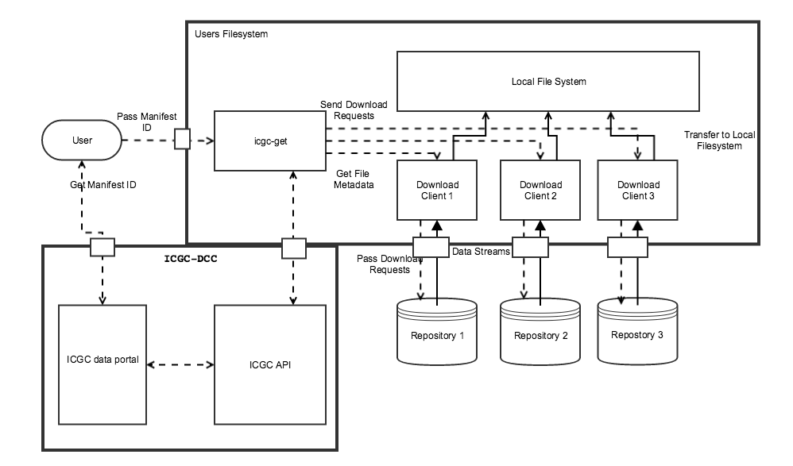
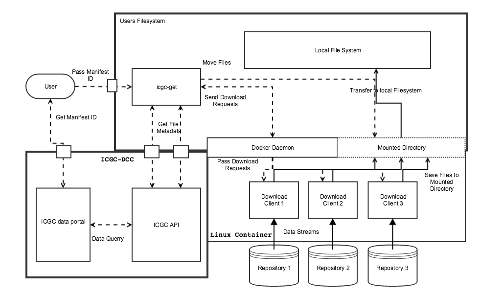

#icgc-get

`icgc-get` is a universal download client for accessing ICGC data residing in various data repositories. 

The data possessed by the ICGC resides in many data repositories around the world. These repositories 
each have their own environment (public cloud, private cloud, on-premise file systems, etc.), 
access controls (DACO, OAuth, asymmetric keys, IP filtering), download clients and configuration mechanisms. 
Thus, there is much for a user to learn and perform before actually acquiring the data. 
This is compounded by the fact that the number of environments are increasing over time 
and their characteristics are frequently changing. A coordinated mechanism to bootstrap and 
streamline this process is highly desirable. This is the problem the `icgc-get` tool helps to solve.

## Configuration
After installing `icgc-get`, you may want to do configure some of the essential usage parameters,
such as your access credentials, usage mode and output directory. The simplest way to do this is to invoke the `icgc-get configure` command
and follow the instructions of the prompts.  This will keep the operation of tool simpler in the future

Should you wish to get started right away, it is possible to run the tool without making a configuration file at all. 
Most of the parameters have default options if no config file is loaded. The only exceptions are _output_, _repos_, 
access credentials and if you are not using Docker, _tool paths_. These options can be passed via the appropriate command line options.

In addition to using the `configure` command, most configuration options can be overwritten either
through the command line, by assigning environmental variables, or by directly editing the `config.yaml` file. 
Environmental variables are in all caps, have underscores as separators, and are prefixed by `ICGCGET_`. Command line options have dashes 
as separators and are prefixed by two dashes. Config file options use a colon, followed by a newline and two spaces as separators. 

To specify which config file to use either pass an absolute path to the config file to the 
command line with `--config`, or declare an environmental variable `ICGCGET_CONFIG` that contains 
the absolute path. If neither of these options are chosen, the tool will look for `.icgc-get/config.yaml`
in your home directory.

`icgc-get` creates logfiles of it's operations, and collects the logfiles generated by some clients.  
The location and name of this logfile can be set with the `--logfile` option, the `logfile:` configuration 
parameters or the `ICGCGET_LOGFILE`. _When downloading files from Collaboratory,
the ICGC Storage Server, GNOS repositories or the GDC additional client logfiles will be saved in the same directory as the specified logfile._

If you wish to use a different version of the docker container, this can be controlled via the `ICGCGET_CONTAINER_TAG`
environmental variable or the `container:   tag:` configuration option. **This is not recommended, and there is the possiblilty
that non-default container versions may not be compatible with your installation of `icgc-get`.**

It is necessary to specify the directory for downloaded files to be saved to under `--output` if you are running 
`icgc-get` locally. 

It is also recommended to specify a common list of repositories in your preferred order of precedence. When downloading
a file, the tool will first try to find the file on the first specified repository, then the second, ect cetra.
Please use the following format to define your repositories in the configuration file.

```yaml
repos:
 - collaboratory
 - pcawg-chicago-icgc
 - pdc
```

Valid repositories are:

| Code                | Repository                     |
| --------            | -------------------------------          |
| `aws-virginia`      | Amazon Web Services                      |
| `collaboratory`     | Collaboratory                            |
| `ega`               | European Genome Association              |
| `gdc`               | Genomic Data Commons                     |
| `pcawg-chicago-icgc | Pan-Cancer Chicago repository            |
| `pcawg-chicago-tcga | Pan-Cancer Chicago repository tcga data  |
| `pcawg-heidelberg   | Pan-Cancer Heidelberg repository         |
| `pcawg-london       | Pan-Cancer London repository             |
| `pcawg-tokyo        | Pan-Cancer Tokyo repository              |
| `pcawg-seoul        | Pan-Cancer Seoul repository              |
| `pcawg-barcelona    | Pan-Cancer Barcelona repository          |
| `pdc`               | Bionimbus Protected Data Cloud           |

All clients require an absolute path to your local client installation set as `ICGCGET_REPO_PATH` as an environmental 
variable or under `repo:   path` in the config file unless they are being run through docker. All clients support the ability to configure the number of 
data streams to use when downloading under `repo:   transport:   parallel` or `REPO_TRANSPORT_PARALLEL`
Most clients can be made to download using the UDT protocol by using the `repo:   udt` config option.  

## Command References

| Universal Options | Description                                                   |
| ----------------- | ---------                                                     |
| `--config`        | Path to configuration file                                    |
| `--logfile`       | Path to log file                                              |
| `--verbose` `-v`  | Flag that increases tool verbosity                            |
| `--docker`        | Option controlling the hosting of clients in docker container |

###Download

| Options        | Description                                                     |
|-----------     |--------------------------------------------------------         |
| `-m`           | Flag used to specify that a manifest id has been passed         |
| `-r`           | Repeatable option used to specify repositories to download from |
| `-o`           | Flag used to override warning messages                          |
| `no-ssl-verify`| Flag used to disable ssl verification.  Not recommended         |

###Report Command

| Options        | Description                                                     |
|------------    |--------------------------------------------------------         |
| `-f`           | Controls output format.  Valid options are `json` and `tsv`     |
| `-t`           | Controls output type.  Valid argument is `summary`              |
| `-r`           | Repeatable option used to specify repositories to download from |
| `-o`           | Flag used to override warning messages                          |
| `no-ssl-verify`| Flag used to disable ssl verification.  Not recommended         |

###Check command

| Options        | Description                                                        |
|------------    |--------------------------------------------------------            |
| IDS            | Specify FI ids to check access to.  Only requiered for PDC and GDC |
| `-r`           | Repeatable option used to specify repositories to download from    |
| `-o`           | Flag used to override warning messages                             |
| `no-ssl-verify`| Flag used to disable ssl verification.  Not recommended            |

### Configure command

| Options        | Description                                   |
|------------    |------------------------------------           |
| `--config` `-c`| Destination for new or exisiting config file  |

## Access

### Collaboratory and AWS

These repositories are both accessed through the [ICGC storage client](https://hub.docker.com/r/icgc/icgc-storage-client/), and share their
configuration parameters under the `icgc` namespace. For both of these repositories
provide an UUID for your ICGC access token to the `icgc:  access` parameter. 
You may also specify the transport file from protocol, under `icgc:  transport:  file.from`.
Further documentation can be found at [here.](http://docs.icgc.org/cloud/guide/)
To apply for access to Collaboratory and AWS see [DACO.](https://icgc.org/daco)

### EGA

[EGA](https://ega-archive.org/) access should be provided as your EGA username to `ega:  username` and your EGA password to `ega:  password`. 
It should be noted that there have been reliability issues experienced should the transport parallel of the EGA client increase beyond 1. 
Further information can be found at [the EGA website](https://www.ebi.ac.uk/ega/about/access)

### GDC

[GDC](https://gdc.nci.nih.gov) access should be provided as the full GDC access token to `gdc:  token`. **Though there are unsecured files
present on the GDC data repository, for simplicity purposes a GDC access token is required for all downloads from the GDC.** Further information
about access can be found at [the GDC documentation.](https://gdc-docs.nci.nih.gov/Data_Transfer_Tool/Users_Guide/Preparing_for_Data_Download_and_Upload/)

### PCAWG

[PCAWG](https://pancancer-token.annailabs.com/) access should be provided as a key to `gnos:   key:   repo:`  where repo is the repository code for the GNOS repository you need to access.  Support for GNOS repositories can be reached at https://pancancer-token.annailabs.com/

### PDC

[PDC](https://bionimbus-pdc.opensciencedatacloud.org) access should be provided as a key to `pdc:  key` and a secret key
to `pdc:  secret`. 
Support for the PDC can be reached [here.](https://bionimbus-pdc.opensciencedatacloud.org)

## Commands

All commands save `configure` share the `--config`, `--logfile` `--verbose/-v` and the `--docker` options.  

### Download command

The syntax for performing a download using `icgc-get` is:

```shell
./icgc-get --config [CONFIG] --docker [true|false] download [IDS] [-m/] [REPO] [OPTIONS]
```

The first required argument is the set of ICGC File ids or manifest id corresponding to the file or files you wish to download. 
This should either be in the form of one or more FI ids, FI followed by some amount of numbers, or a manifest uuid. If this is for a 
manifest id append the tag `-m` or `--manifest`. These ids may be retrieved from the [ICGC data portal.](https://dcc.icgc.org)  `icgc-get`
is not capable of parsing a manifest file on the local machine.

Using this command also requires you to specify the repository or repositories that are being targeted for download and the output directory,
provided they have not been added to the config file.

**Prepend each repository with `-r`**, for example `-r aws-virginia -r ega`. The order that the repositories
are listed is important: files will be downloaded from the first specified repository if possible, and subsequent repositories
only if the file was not found on any previous repository. 

The download command comes with an automatic prompt that warns the user if the projected download size approaches the 
total available space in the download directory. It is possible to suppress this warning using the `-o` flag.

Sample invocation of the `download` command:

```shell
./icgc-get download FI378424 -r  collaboratory
```

### Report command

Another useful subcommand is `report`. This takes the same primary inputs as `download`,
but instead of downloading the specified files, it will provide a list of all files that are
about to be downloaded, including their size, data type, name and the repository they are hosted on. 

By default the command outputs a table, but the output can be altered to json via `-f json` or tsv
via `-f tsv`. _Should you find file by file output too granular for a particularly large download, 
the option `-t summary` can be used to switch to a summarized version of the table._  If an output directory
is specified, then the command will search that directory to determine of any of the files are already present,
and add a `downloaded` column that marks these files. 

Example invocations of the `report` commands:

```shell
./icgc-get report FI99996 FI99990 FI250134 -r collaboratory -r gdc
```

```shell
./icgc-get report FI99996 FI99990 FI250134 -r collaboratory -r gdc -t summary
```

Sample output:

```
╒══════════╤════════╤════════╤═══════════════╤═══════════════╤═══════════════╕
│          │   Size │ Unit   │ File Format   │ Data Type     │ Repo          │
╞══════════╪════════╪════════╪═══════════════╪═══════════════╪═══════════════╡
│ FI99996  │   3.52 │ GB     │ BAM           │ Aligned Reads │ gdc           │
├──────────┼────────┼────────┼───────────────┼───────────────┼───────────────┤
│ FI99990  │  435.7 │ MB     │ BAM           │ Aligned Reads │ gdc           │
├──────────┼────────┼────────┼───────────────┼───────────────┼───────────────┤
│ FI250134 │ 197.44 │ KB     │ VCF           │ StGV          │ collaboratory │
╘══════════╧════════╧════════╧═══════════════╧═══════════════╧═══════════════╛
```

```
╒══════════════════════╤════════╤════════╤══════════════╤═══════════════╕
│                      │   Size │ Unit   │   File Count │   Donor_Count │
╞══════════════════════╪════════╪════════╪══════════════╪═══════════════╡
│ collaboratory        │ 197.44 │ KB     │            1 │             1 │
├──────────────────────┼────────┼────────┼──────────────┼───────────────┤
│ collaboratory: StGV  │ 197.44 │ KB     │            1 │             1 │
├──────────────────────┼────────┼────────┼──────────────┼───────────────┤
│ gdc                  │   3.94 │ GB     │            2 │             2 │
├──────────────────────┼────────┼────────┼──────────────┼───────────────┤
│ gdc: Aligned Reads   │   3.94 │ GB     │            2 │             2 │
├──────────────────────┼────────┼────────┼──────────────┼───────────────┤
│ Total                │   3.94 │ GB     │            3 │             3 │
├──────────────────────┼────────┼────────┼──────────────┼───────────────┤
│ Total: Aligned Reads │   3.94 │ GB     │            2 │             2 │
├──────────────────────┼────────┼────────┼──────────────┼───────────────┤
│ Total: StGV          │ 197.44 │ KB     │            1 │             1 │
╘══════════════════════╧════════╧════════╧══════════════╧═══════════════╛
```

### Configure command

This command will start a series of prompts for you to enter application paths, access credentials, output directories and logfile locations.
_Any of these prompts can be bypassed by immediately pressing the enter key if the parameter is not relevant for your planned use 
of `icgc-get`._  By default, `configure` will write to the default config file, but the destination can be overwritten with 
the `-c` tag. Should there be an existing configuration file at the target destination, existing configuration values can be kept
by pressing enter in response to the prompt. Please note that some access tokens, passwords, and secret keys will not be shown on the 
command prompt for security reasons, but can still be entered and can still be kept as the current value by pressing enter.  

### Check command

The `check` command will test the provided credentials for each repository specified.

Due to the security protocols of each client, there are two ways in which this access check can occur. 
_For PDC, GNOS and GDC icgc-get is only capable of determining if you have access to the specific 
files targeted for download, not the state of your permissions for the repository as a whole._ 
When performing an access check for these repositories, you must provide a manifest id or 
list of files using the same formatting as the `download` command. For more detailed information about 
your permissions on these repositories contact their respective support departments.

For the AWS, Collaboratory, and EGA repositories, the access check will determine if you have access
to the entire repository or not. These checks will occur even if file prioritization leads to no files
being downloaded from any of these repositories.    

To do a status check on the same files used in the examples above:

```shell
./icgc-get check FI99996 FI99990 FI250134 -r collaboratory -r gdc
```

Sample output:

```
Valid access to the Collaboratory.
Valid access to the GDC files
```

### Version command

The only other subcommand is to display the version of all clients used by `icgc-get`. This command 
will check the version of clients that have their tool paths are specified in the config file provided.

```shell
./icgc-get version
```

Sample output:

```
ICGC-Get Version: 0.2.6
Clients:
 AWS CLI Version:             1.10.34
 EGA Client Version:          2.2.2
 GDC Client Version:          0.7
 ICGC Storage Client Version: 1.0.13
```

##Diagrams
Below are a pair of diagrams demonstrating the processes that icgc-get undergoes during it's operation.

###`icgc-get` environment diagram

[](images/ICGC_get_standard.png "Click on the image to see it in full")

###`icgc-get` environment diagram when using docker

[](images/ICGC_get_docker.png "Click on the image to see it in full")
