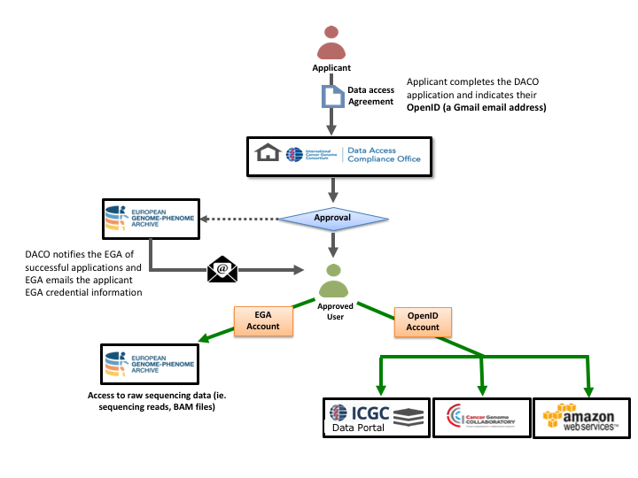

# Apply for Access to Controlled Data

## Data Access Control Bodies

ICGC projects have two separate access control bodies. US based projects are authorized by **dbGaP**, while non-US projects are authorized by the ICGC Data Access Compliance Office (**DACO**). To download controlled data, a user must apply for access at the corresponding data access control body. The following table shows you which repository you are able to download from if you have been granted authorization from **dbGaP** or ICGC **DACO**.

| *Authorization From:*  | Data Portal | Collaboratory |  AWS |  EGA  | GDC   |  PDC  | Azure |
| :--------------------| ----------- | ------------- | ---- | ----- | ----- | ----- | ----- |
|   *ICGC DACO*	       |    |  |  |  |       |       |  |
|   *dbGaP/eRA Commons*  |             |               |      |       |   |  | |

## Guidelines for Applying for Access to Controlled Data

While all ICGC data sources contain open data, sensitive genomic and clinical data is controlled and requires permission to access. To qualify for access, you must:

- be an independent researcher affiliated with a legal entity (e.g. university professor, researcher in a private company, independent researchers able to apply for federal research grants, etc.)
- have an institutional representative at your institution
- have a scientific abstract and lay summary outlining the desired use of the ICGC Controlled Data
- have at least 3 qualifying publications of which you were an author/co-author
- include an ethics letter, if ethics approval for use of ICGC Controlled Data is required in your country/region

## How to Apply for Access through DACO

To obtain access to ICGC Controlled Data, learn more about the DACO application process [here](https://docs.icgc-argo.org/docs/data-access/daco/applying), and then [start a DACO application](https://daco.icgc-argo.org/).

***Please note:*** EGA is not responsible for granting access to ICGC data hosted at EGA.

## Next steps after DACO Approval

Once your DACO application has been approved, log in to the **[ICGC Data Portal](https://dcc.icgc.org/)** using the **same Google email address (OpenID)** that is associated with your DACO account.

   

After successful authentication, you will see a green shield icon if you are approved for DACO access, and a green cloud icon if you are approved for Cloud access to the controlled tier.

   

### Obtaining Access to dbGaP-Controlled Data in GDC or PDC 

One of the widely used access control system is [database of Genotypes and Phenotypes Authorized Access program](https://dbgap.ncbi.nlm.nih.gov/aa/wga.cgi?page=login). _dbGaP requires an eRA account to log in and register. If you need to register your organization you will need your organization's signing offical to participate in the registration process._

If you encounter difficulties, the [dbGaP help desk](https://dbgap.ncbi.nlm.nih.gov/aa/wga.cgi?page=email&filter=from&from=login) is available.

