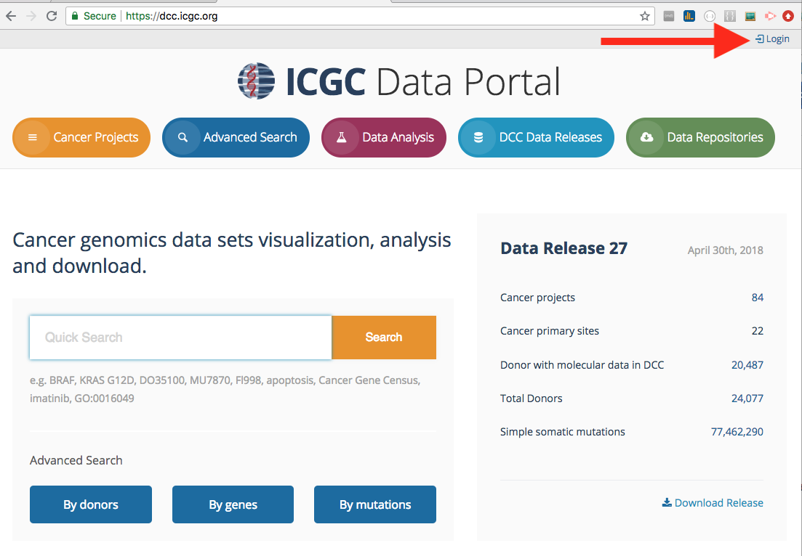

# Apply for Access to Controlled Data

## Data Access Control Bodies

ICGC projects have two separate access control bodies. US based projects are authorized by **dbGaP**, while non-US projects are authorized by the ICGC Data Access Compliance Office (**DACO**). To download controlled data, a user must apply for access at the corresponding data access control body. The following table shows you which repository you are able to download from if you have been granted authorization from **dbGaP** or ICGC **DACO**.

| *Authorization From:*  | Data Portal | Collaboratory |  AWS |  EGA  | GDC   |  PDC  | Azure |
| :--------------------| ----------- | ------------- | ---- | ----- | ----- | ----- | ----- |
|   *ICGC DACO*	       |    |  |  |  |       |       |  |
|   *dbGaP/eRA Commons*  |             |               |      |       |   |  | |

## Guidelines for Applying for Access to Controlled Data

While there is great potential of data sharing for scientific research, caution is required when sharing data about individuals participating in genomic research because genomic data, like other types of medical data, can contain personal and identifying information. As such, DACO applications will only be considered for qualified scientists (individuals or groups from an institution) researching public health objectives.

As a prerequisite to applying for DACO access, please ensure that you:

- are associated to a research institution or company,
- have a signing officer at your institution (authorized institutional representative),
- have a scientific abstract outlining the desired use of the ICGC data with at least 3 relevant publications of which you were an author or a co-author.

## How to Apply for Access through DACO

The instructions for applying for DACO can be found here on the [ICGC DACO website](https://daco.icgc.org/).

***Please note:*** EGA is not responsible for granting access to ICGC data hosted at EGA.

## Next steps after DACO Approval

Once your DACO application has been approved, log in to the **[ICGC Data Portal](https://dcc.icgc.org/)** using the **same Google email address (OpenID)** that is associated with your DACO account.

   

After successful authentication, you will see a green shield icon if you are approved for DACO access, and a green cloud icon if you are approved for Cloud access to the controlled tier. Please note, if you intend to access controlled data in the Cloud, please ensure you complete the "Cloud Storage Access Agreement" section of your DACO application. Otherwise, you will see a red cloud icon.

   

### Obtaining Access to dbGaP-Controlled Data in GDC or PDC 

One of the widely used access control system is [database of Genotypes and Phenotypes Authorized Access program](https://dbgap.ncbi.nlm.nih.gov/aa/wga.cgi?page=login). _dbGaP requires an eRA account to log in and register. If you need to register your organization you will need your organization's signing offical to participate in the registration process._

If you encounter difficulties, the [dbGaP help desk](https://dbgap.ncbi.nlm.nih.gov/aa/wga.cgi?page=email&filter=from&from=login) is available.

