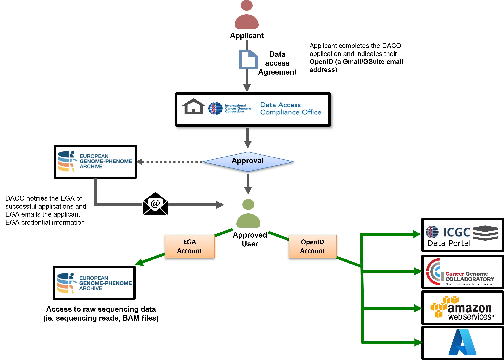

# Apply for Access to Controlled Data

## Data Access Control Bodies

ICGC projects have two separate access control bodies. US based projects are authorized by **dbGaP**, while non-US projects are authorized by the ICGC Data Access Compliance Office (**DACO**). To download controlled data, a user must apply for access at the corresponding data access control body. The following table shows you which repository you are able to download from if you have been granted authorization from **dbGaP** or ICGC **DACO**.

| *Authorization From:*  | Data Portal | Collaboratory |  AWS |  EGA  | GDC   |  PDC  |
| :--------------------| ----------- | ------------- | ---- | ----- | ----- | ----- |
|   *ICGC DACO*	       |    |  |  |  |       |       |
|   *dbGaP/eRA Commons*  |             |               |      |       |   |  |

## Guidelines for Applying for Access to Controlled Data

While there is great potential of data sharing for scientific research, caution is required when sharing data about individuals participating in genomic research because genomic data, like other types of medical data, can contain personal and identifying information. As such, DACO applications will only be considered for qualified scientists (individuals or groups from an institution) researching public health objectives.

As a prerequisite to applying for DACO access, please ensure that you:

- are associated to a research institution or company,
- have a signing officer at your institution (authorized institutional representative),
- have a scientific abstract outlining the desired use of the ICGC data with at least 3 relevant publications of which you were an author or a co-author.

## How to Apply for Access through DACO

The instructions for applying for DACO can be found here on the [ICGC DACO website](https://daco.icgc.org/), as well as a selection of [help guide videos](https://daco.icgc.org/help-guides/daco-help-guides/).

1. Register a DACO account at https://daco.icgc.org/user/#/register. If you already have an account, you can log in from https://daco.icgc.org/user/#/login. 
1. After registering, you will receive an email instructing you to set your Central User Directory password. Click the link from the email to set up your account password.
1. Once you save your password, you will be taken to your ICGC Dashboard. From your Dashboard, click the "Start New Application" button the box entitled “Manage Your Submissions”.
1. Complete the entire application form. All sections, as well as Appendices, are integral components of the application.

   > **IMPORTANT: For the applicant and any authorized personnel, you will be asked to provide an “OpenID”, which means providing a valid Google email address (Gmail or GSuite) for each authorized personnel.** This will be the email address you will use to log in to the ICGC Data Portal for accessing controlled data.

1. Once the application is complete, you can submit it by “finalizing your DACO Application”. This action will prevent you from making any further changes to your application without authorization from an administrator.
1. You will receive an email with further instructions. The next steps will also be listed on the confirmation page. Download and print your finalized application and add the necessary signatures. Once signed, you can fax or mail the application to the DACO office (the contact details are provided on the confirmation page and email).
1. The DACO office will notify you when your application has been approved, or if they require any further information.
1. Once your DACO access application is approved, your “OpenID” Google email address will become associated with an ICGC account and you will be granted access to the ICGC controlled access datasets available through [Cancer Genome Collaboratory](repositories/#collaboratory), [AWS Virginia](repositories/#aws), the EBI’s [EGA repository](repositories/#ega) and [ICGC Data Portal](https://dcc.icgc.org/releases). You will receive an email from EGA about setting up your password to access controlled data at [https://ega-archive.org/](https://ega-archive.org/). If you already had an EGA account from before, you will use the same username/password to access ICGC controlled data at EGA.

***Please note:*** EGA is not responsible for granting access to ICGC data hosted at EGA.

## The DACO Approval Process

The DACO approval process takes approximately 24-48 hours.

Your research project will be checked for conformity with the goals and [policies of ICGC ARGO](https://www.icgc-argo.org/page/72/introduction-and-goals-) including, but not limited to, policies concerning the purpose and relevance of the research, the protection of the participants and the security of the participants' data.

The DACO office will notify you by email when your DACO application has been approved, or if they require any further information. Upon approval, access to controlled data will be granted for a **one year period** (starting from the date of acceptance). If your application is refused it remains possible to reapply in the future.

## Next steps after DACO Approval

Once your DACO application has been approved, log in to the **[ICGC Data Portal](https://dcc.icgc.org/)** using the **same Google email address (OpenID)** that is associated with your DACO account.

   

After successful authentication, you will see a green shield icon if you are approved for DACO access, and a green cloud icon if you are approved for Cloud access to the controlled tier. Please note, if you intend to access controlled data in the Cloud, please ensure you complete the "Cloud Storage Access Agreement" section of your DACO application. Otherwise, you will see a red cloud icon.

   

### Obtaining Access to dbGaP-Controlled Data in GDC or PDC 

One of the widely used access control system is [database of Genotypes and Phenotypes Authorized Access program](https://dbgap.ncbi.nlm.nih.gov/aa/wga.cgi?page=login). _dbGaP requires an eRA account to log in and register. If you need to register your organization you will need your organization's signing offical to participate in the registration process._

If you encounter difficulties, the [dbGaP help desk](https://dbgap.ncbi.nlm.nih.gov/aa/wga.cgi?page=email&filter=from&from=login) is available.

