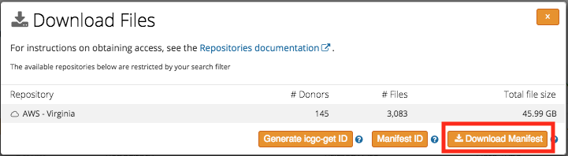

# Downloading Data

## Downloading data from Collaboratory repository

Academic research cloud infrastructure built to house ICGC data.

| Property         | Value                                                                                                                                            |
| :--------------- | ------------------------------------------------------------------------------------------------------------------------------------------------ |
| Name             | Cancer Genome Collaboratory                                                                                                                      |
| Contact          | <mailto:dcc-support@icgc.org>                                                                                                      |
| Repository type  | Cloud                                                                                                      |
| ICGC Portal Page | [Portal](https://dcc.icgc.org/repositories?filters=%7B%22file%22:%7B%22repoName%22:%7B%22is%22:%5B%22Collaboratory%20-%20Toronto%22%5D%7D%7D%7D) |
| Download Client  | [Tarball](/software/download/#score-client), [Docker](https://hub.docker.com/r/overture/score/) |
| Repo Code        | `collaboratory`                                                                                                                                  |

#### Prerequisites

1.  [Apply for DACO access](https://github.com/icgc-dcc/dcc-docs/blob/download-doc-update/docs/download/data-access.md#apply-for-access-to-controlled-data)
2.  Download and install score-client software [Tarball](/software/download/#score-client), [Docker](https://hub.docker.com/r/overture/score/) (Download/configuration instructions [here](https://docs.icgc.org/download/guide/#installation-of-the-score-client))

#### Download Data Instructions

1.  Once your DACO application has been approved, use your OpenID (ie. the Gmail email address you specified in your DACO application) to log into [https://dcc.icgc.org/](https://dcc.icgc.org)

    

2.  After successful authentication, you will know that you have Cloud Access to the controlled tier if the `Login` link is replaced with a green cloud icon

    

3.  Click on `Token Manager`
    

4.  Select `collab.download` and click `Generate` button to create an access token for downloading data from Collaboratory

    


5\. Copy and paste this token into your config file for score-client. Click [here](https://docs.icgc.org/download/guide/#access-configuration) for instructions on how to configure other elements of score-client. The configuration of the Score Client is stored in the `conf/application.properties` file of the distribution. Edit `application.properties` file to add the generated acesss token. 
   
    Example manifest user configuration

    ```
    #
    # Defines the ICGC access token for authorized access to data
    #
    accessToken=paste_your_collab.download_token_here
    
    #
    # Controls the number of concurrent threads for multi-part data transfers. It is recommended to set this to the number of cores of the Compute Instance.
    #
    transport.parallel=6
    
    #
    # Controls the amount of non-heap memory per thread, in gigabytes. It is recommended set this to a value of 1 (1 GB). Be sure to leave enough memory for the operating system and any other software that may be running on the Compute Instance
    #
    transport.memory=1
    ```

6\. Find your data of interest in the [Data Repository](https://dcc.icgc.org/repositories) by selecting `Collaboratory` repository. Click on "Download Files" and download the manifest file

   

7\.  Decompress manifest tarball file. Run score-client with manifest file to download data

```
tar xvzf manifest.1554492262428.tar.gz
./bin/score-client --profile collab download --manifest manifest.collaboratory.1554492262428.tsv --output-dir score-client_downloads
```

## Downloading data from GDC repository

The Genomic Data Commons is a US government ([NIH](https://www.nih.gov/) / [NCI](https://www.cancer.gov/)) run data repository for cancer genomic information. Notably, the it carries data from The Cancer Genome Atlas (TCGA) and the Therapeutically Applicable Research to Generate Effective Treatments (TARGET). Currently the GDC is the largest single repository of ICGC data. It focuses on studies in the United States.

| Property             | Value                                                                                                                                  |
| :------------------- | -------------------------------------------------------------------------------------------------------------------------------------- |
| Name                 | Genomic Data Commons                                                                                                                   |
| Contact              | <mailto:support@nci-gdc.datacommons.io>                                                                                                |
| Repository type      | Non-Cloud                                                                                                      |
| Official Data Portal | <https://portal.gdc.cancer.gov/>                                                                                                      |
| ICGC Portal Page     | [Portal](https://dcc.icgc.org/repositories?filters=%7B%22file%22:%7B%22repoName%22:%7B%22is%22:%5B%22GDC%20-%20Chicago%22%5D%7D%7D%7D) |
| Download Client      | Download the client [here](https://gdc.cancer.gov/access-data/gdc-data-transfer-tool)                                                                 |
| Repo Code            | `gdc`                                                                                                                                  |

#### Prerequisites

1. Obtain dbGaP access and an NIH eRA Commons account (refer to instructions [here](https://gdc.cancer.gov/access-data/obtaining-access-controlled-data))
2. Download the [GDC Data Transfer Tool](https://gdc.cancer.gov/access-data/gdc-data-transfer-tool)
3. Once you have obtained controlled data access from dbGaP, you will need to download your access authentication token from the GDC Data Portal. Refer to GDC documentation [here](https://docs.gdc.cancer.gov/Data_Transfer_Tool/Users_Guide/Preparing_for_Data_Download_and_Upload/#obtaining-an-authentication-token-for-data-downloads) for instructions. 
4. Save the GDC authentication token in a text file (example: `gdc-user-token.txt`)

#### Download Data Instructions

1. Find your data of interest in the [Data Repository](https://dcc.icgc.org/repositories) by selecting `GDC` repository. Click on `Download Files` and download the manifest file

    

2. Run the GDC Client tool to download data

```
./gdc-client download -m test/manifest.gdc.1554495935637.tsv -t gdc-user-token.txt -d gdc_downloads
```

## Downloading data from EGA repository

The European Genome-Phenome Archive ([EGA](https://ega-archive.org/)) is co-managed by [EBI](https://www.ebi.ac.uk/) and [CRG](http://www.crg.eu/). Data can only be downloaded through their EGA download client, but metadata may be viewed on their website. Files are grouped into datasets based on the study they were collected in, and access is granted on a dataset by dataset basis. This repository carries both ICGC and non-ICGC data.

| Property         | Value                                                                                                                                  |
| :--------------- | -------------------------------------------------------------------------------------------------------------------------------------- |
| Name             | European Genome Archive                                                                                                                |
| Contact          | <mailto:helpdesk@ega-archive.org>                                                                                                      |
| Repository type  | Non-Cloud                                                                                                      |
| Offical Website  | <https://ega-archive.org>                                                                                                              |
| ICGC Portal Page | [Portal](https://dcc.icgc.org/repositories?filters=%7B%22file%22:%7B%22repoName%22:%7B%22is%22:%5B%22EGA%20-%20Hinxton%22%5D%7D%7D%7D) |
| Download Client  | [Zipfile](https://ega-archive.org/download/using-ega-download-client#DownloadClient)                                                   |
| Repo Code        | `ega`                                                                                                                                  |

#### Prerequisites

1. [Apply for DACO access](https://github.com/icgc-dcc/dcc-docs/blob/download-doc-update/docs/download/data-access.md#apply-for-access-to-controlled-data). Once you are approved by DACO, you will recieve an email from EGA about setting up your password. If you already had an EGA account from before, you will use the same username/password to access ICGC controlled data at EGA.
2. Download the [EGA Download Client](https://ega-archive.org/download/using-ega-download-client)

#### Download Data Instructions

1. Find your data of interest at [https://dcc.icgc.org/repositories](https://dcc.icgc.org/repositories) (click on `EGA` repository). Click on `Download Files` and download manifest file.
    

2\. The downloaded manifest file is actually a shell script and you will need to edit some variables in it before running the script
    * enter your EGA username
    * enter your EGA password
    * enter the directory you want to download files to
    * enter path to EGA Download Client

Example manifest user configuration
```
###############################################################################
# User Configuration (Required)
###############################################################################

# Your EGA username (e.g. user@example.org):
username=some_user@oicr.on.ca

# Your EGA password:
password=Your_EGA_password

# Where to place downloads (must exist):
output_dir=/home/ega_downloads

# Path to EgaDemoClient.jar (must exist at this location):
bin_dir=/home/ega_download_tool/
```

3\. Run manifest script

```
./manifest.ega.1554736977052.sh
```


## Downloading data from PDC repository

The Bionimbus Protected Data Cloud (PDC) is a secure biomedical cloud operated at FISMA moderate as IaaS with an NIH Trusted Partner status for analyzing and sharing protected datasets. The Bionimbus PDC is a collaboration between the University of Chicago Center for Data Intensive Science (CDIS) and the Open Commons Consortium (OCC). The Bionimbus PDC allows users authorized by NIH to compute over human genomic data in a secure compliant fashion. It is a secure data cloud that stores US [PCAWG](https://dcc.icgc.org/pcawg) data.

| Property             | Value                                                                                                                                   |
| :------------------- | --------------------------------------------------------------------------------------------------------------------------------------- |
| Name                 | Bionimbus Protected Data Cloud                                                                                                          |
| Contact              | <mailto:support@opensciencedatacloud.org>                                                                                               |
| Repository type      | Cloud                                                                                                      |
| Official Website     | <https://bionimbus-pdc.opensciencedatacloud.org>                                                                                        |
| ICGC Portal Page     | [Portal](https://dcc.icgc.org/repositories/?filters=%7B%22file%22:%7B%22repoName%22:%7B%22is%22:%5B%22PDC%20-%20Chicago%22%5D%7D%7D%7D) |
| Download Client      | [Amazon Web Services Command Line Interface](http://docs.aws.amazon.com/cli/latest/userguide/installing.html)                           |
| Client Documentation | [AWS Guide](http://docs.aws.amazon.com/cli/latest/userguide/using-s3-commands.html)                                                     |
| Repo Code            | `pdc`                                                                                                                                   |


#### Prerequisites

1. Obtain dbGaP access and an NIH eRA Commons account (follow same instructions as GDC [here](https://gdc.cancer.gov/access-data/obtaining-access-controlled-data))
2. PDC stores PCAWG TCGA data in Cleversafe object stores, where direct download access to Cleversafe buckets is provided to authorized users. Cleversafe is compatible with AWS S3, so you will need to use the `awscli` client to download objects. Download [AWS CLI](https://docs.aws.amazon.com/cli/latest/userguide/cli-chap-install.html)
3. Once you are approved by dbGaP, you will need to obtain your PDC keys to configure AWS CLI. To get these keys, click on `Login from NIH` on this page: [https://bionimbus-pdc.opensciencedatacloud.org/datasets](https://bionimbus-pdc.opensciencedatacloud.org/datasets)

    

4. This will redirect you to the login page for NIH iTrust.

    

5. After you have successfully logged in, you will be redirected back to PDC where you can create an access key. If you see `TCGA-PCAWG` in the project list and you have `download` rights, you can proceed with generating an access key. Click on `Create access key` button. A popup will show you the new access key and secret key.

    

6\. Copy these keys and add them to your awscli credentials file, which depending on your system, is usually at: `~/.aws/credentials`. The aws credentials file may look like this. Please edit it to include your own key ID and secret key

```
[pdc]
aws_access_key_id = your_pdc_access_key_id
aws_secret_access_key = your_pdc_secret_access_key
```

You can also run `aws configure` and follow the prompts.


#### Download Data Instructions

1. Find your data of interest in the [Data Repository](https://dcc.icgc.org/repositories) by selecting `PDC` repository. Click on `Download Files` and download manifest file.
    

2\. The manifest file that you downloaded from ICGC Data Portal for PDC is actually a shell script containing aws cli commands, one line per file. Here's an example
```
aws --profile pdc --endpoint-url https://bionimbus-objstore-cs.opensciencedatacloud.org s3 cp s3://pcawg-tcga-lihc-us/230e20d7-38da-5aa0-89ac-071bd509cd53 .
```
You can execute the above line directly on the command line, or you can execute the manifest script file to download the object(s) to local.


## Downloading Data from the AWS repository

Amazon cloud service containing ICGC data.

| Property         | Value                                                                                                                                   |
| :--------------- | --------------------------------------------------------------------------------------------------------------------------------------- |
| Name             | ICGC Storage Server (hosted at AWS)                                                                                                                 |
| Contact          | <mailto:dcc-support@icgc.org>                                                                                                      |
| Repository type  | Cloud                                                                                                      |
| ICGC Portal Page | [Portal](https://dcc.icgc.org/repositories?filters=%7B%22file%22:%7B%22repoName%22:%7B%22is%22:%5B%22AWS%20-%20Virginia%22%5D%7D%7D%7D) |
| Download Client  | [Tarball](/software/download/#score-client), [Docker](https://hub.docker.com/r/overture/score/) |
| Repo Code        | `aws-virginia`                                                                                                                          |


   <span style="color:blue">NOTE: In order to download data from AWS, the score-client tool must run in the same environment as the object storage system. That means you will need your own AWS account to provision a running EC2 instance and the Score Client must run on an AWS VM in the N. Virginia availability zone.</span>


#### Prerequisites

1. [Apply for DACO access](https://github.com/icgc-dcc/dcc-docs/blob/download-doc-update/docs/download/data-access.md#apply-for-access-to-controlled-data). Once you are approved by DACO, you will recieve an email from EGA about setting up your password. If you already had an EGA account from before, you will use the same username/password to access ICGC controlled data at EGA.


2. Set up EC2 instance in AWS. Ensure that you are running within the `us-east-1` region (N. Virginia availability zone). Any data processing will be charged to this account. Note that ICGC data download from S3 to the same EC2 region is free of charge. Please see Amazon's documentation [here](https://docs.aws.amazon.com/AWSEC2/latest/UserGuide/concepts.html#how-to-get-started) for detailed instructions on how to set up your Amazon EC2 instance. If this is your first time setting up an Amazon EC2 instance, here is some helpful documentation from AWS to get you started:
   
    * [Amazon User Guide on EC2 instances](https://docs.aws.amazon.com/AWSEC2/latest/UserGuide/concepts.html) 
    * [Launching a Linux Virtual Machine (VM)](https://aws.amazon.com/getting-started/tutorials/launch-a-virtual-machine/?trk=gs_card)

3. Download and install score-client software on the AWS VM. Score-client download instructions [here](https://docs.icgc.org/download/guide/#installation-of-the-score-client)

4. Next, you will need to obtain your access token to download data from AWS. Once your DACO application has been approved, use your OpenID (ie. the Gmail email address you specified in your DACO application) to log into [https://dcc.icgc.org/](https://dcc.icgc.org)

    

5. After successful authentication, you will know that you have Cloud Access to the controlled tier if the "Login link is replaced with a green cloud icon

    

6. Click on Token Manager
    

7. Select `aws.download` and click "Generate" button to create an access token for downloading data from Collaboratory

    


8\. Copy and paste this token into your config file for score-client *on the AWS VM*. Click [here](https://docs.icgc.org/download/guide/#access-configuration) for instructions on how to configure other elements of score-client. The configuration of the Score Client is stored in the `conf/application.properties` file of the distribution. Edit `application.properties` file to add the generated acesss token.

    Example manifest user configuration
    ```
    #
    # Defines the ICGC access token for authorized access to data
    # 
    accessToken=paste_your_aws_token_here
    
    #
    # Controls the number of concurrent threads for multi-part data transfers. It is recommended to set this to the number of cores of the Compute Instance.
    #
    transport.parallel=6
    
    #
    # Controls the amount of non-heap memory per thread, in gigabytes. It is recommended set this to a value of 1 (1 GB). Be sure to leave enough memory for the operating system and any other software that may be running on the Compute Instance
    #
    transport.memory=1
    ```

#### Download Data Instructions
1. Find your data of interest in the [Data Repository](https://dcc.icgc.org/repositories) by selecting `AWS` repository. Click on "Manifest ID"
    

2. This will generate a score-client command which you can use to download files from AWS
    

3. Run the score-client command *on the AWS VM* (Remember to specify the download directory using the `--output-dir` flag)

    ```
    bin/score-client download --manifest 19fa5fe2-ce2e-4657-8072-8c7a30e70847
    ```
