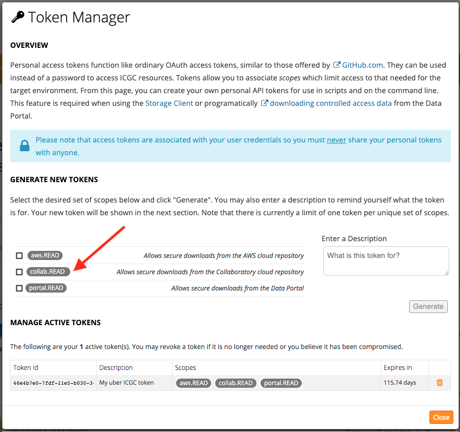
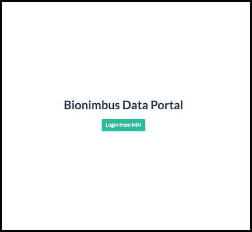

# Downloading Data

## Downloading data from Collaboratory repository

#### Prerequisites:

1. Apply for DACO access
2. Download and install score-client software and/or icgc-get (include link to software)

#### Download Data Instructions:

1. Once your DACO application has been approved, use your OpenID (ie. the Gmail email address you specified in your DACO application) to log into https://dcc.icgc.org/:


2. After successful authentication, you will know that you have Cloud Access to the controlled tier if the “login” link is replaced with a green cloud icon:


3. Click on Token Manager


4. Select "collab.download" and click "Generate" button to create an access token for downloading data from Collaboratory




5. Copy and paste this token into your config file for score-client

    * The configuration of the Score Client is stored in the conf/application.properties file of the distribution
    * Edit application.properties and add the generated accesss token to the line:

```
accessToken=ALPHANUMERICTOKEN-01234567890+AlPhAnUmErIcToKeN=0123456789-ALPHANUMERICTOKEN-01234567890+AlPhAnUmErIcToKeN=0123456789-ALPHANUMERICTOKEN-01234567890+AlPhAnUmErIcToKeN=0123456789-
```

6. Find your data of interest at https://dcc.icgc.org/repositories in the Collaboratory repository. Click on "Download Files" and download the manifest file


7. Decompress file. Run score-client with  manifest file to download data

```
tar xvzf manifest.1554492262428.tar.gz
./bin/score-client --profile collab download --manifest manifest.collaboratory.1554492262428.tsv --output-dir score-client_downloads
```

## Downloading data from GDC repository

#### Prerequisites:

1. Obtain dbGaP access and an NIH eRA Commons account (https://gdc.cancer.gov/access-data/obtaining-access-controlled-data)
2. Download GDC Data Transfer Tool from https://gdc.cancer.gov/access-data/gdc-data-transfer-tool
3. Once you have obtained controlled data access from dbGaP, you will need to download your access authentication token from the GDC Data Portal. Refer to (https://docs.gdc.cancer.gov/Data_Transfer_Tool/Users_Guide/Preparing_for_Data_Download_and_Upload/#obtaining-an-authentication-token-for-data-downloads) for instructions. 
4. Save the GDC authentication token in a text file

#### Download Data Instructions:


1. Find your data of interest at https://dcc.icgc.org/repositories (click on 'GDC'  repository). Click on "Download Files" and download the manifest file


2. Run the GDC Client tool to download data

```
./gdc-client download -m test/manifest.gdc.1554495935637.tsv -t gdc-user-token.txt -d gdc_downloads
```

## Downloading data from EGA repository

#### Prerequisites:

1. Apply for DACO access. Once you are approved by DACO, you will recieve an email from EGA about setting up your password. If you already had an EGA account from before, you will use the same username/password to access ICGC controlled data at EGA.
2. Download EGA Download Client (refer to https://ega-archive.org/download/using-ega-download-client)

#### Download Data Instructions:

1. Find your data of interest at https://dcc.icgc.org/repositories (click on 'EGA'  repository). Click on "Download Files" and download manifest file.


2. The downloaded manifest file is actually a shell script and you will need to edit some variables in it before running the script:
 - enter your EGA username
 - enter your EGA password
 - enter the directory you want to download files to
 - enter path to EGA Download Client

 Example manifest user configuration:
 

3. Run script:

```
./manifest.ega.1554736977052.sh
```


## Downloading data from PDC repository

#### Prerequisites:

1. Obtain dbGaP access and an NIH eRA Commons account (https://gdc.cancer.gov/access-data/obtaining-access-controlled-data)
2. Download AWS CLI (refer to instructions at https://docs.aws.amazon.com/cli/latest/userguide/cli-chap-install.html)
3. Once you are approved by dbGaP, you will need to obtain your PDC keys. Click on "Login from NIH" on this page: https://bionimbus-pdc.opensciencedatacloud.org/datasets



4. This will redirect you to the login page for NIH iTrust.


5. After you have successfully logged in, you will be redirected back to PDC where you can create an access key. If you see "TCGA-PCAWG" in the project list and you have "downlod" rights, you can proceed with generating an access key. Click on "Create access key" button. A popup will show you the new access key and secret key.


7. Copy these keys and add them to your awscli credentials file, which depending on your system, is usually at: ~/.aws/credentials. The file may look like this. Please edit it to include your own key ID and secret key:

```
[pdc]
aws_access_key_id = your_pdc_access_key_id
aws_secret_access_key = your_pdc_secret_access_key
```

#### Download Data Instructions:

1. Find your data of interest at https://dcc.icgc.org/repositories (click on 'PDC'  repository). Click on "Download Files" and download manifest file.


2. The manifest file that you downloaded from ICGC Data Portal for PDC is actually a shell script containing aws cli commands, one line per file. Here's an example:
```
aws --profile pdc --endpoint-url https://bionimbus-objstore-cs.opensciencedatacloud.org s3 cp s3://pcawg-tcga-lihc-us/230e20d7-38da-5aa0-89ac-071bd509cd53 .
```
You can execute the above line directly on the command line, or you can execute the manifest script file to download the object(s) to local.


 


