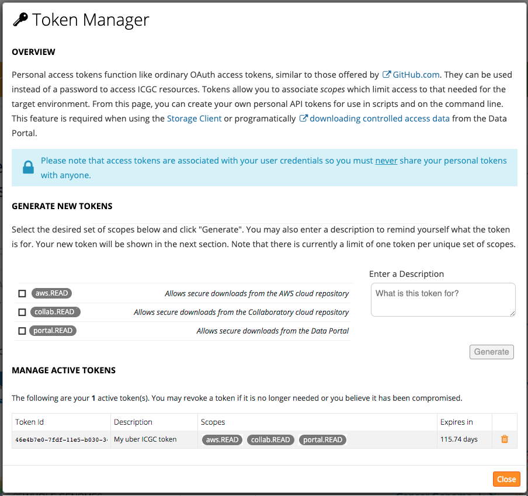
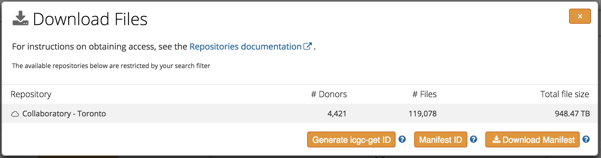

# Data Download Guide

## Overview

This user guide describes the steps to securely explore and download ICGC data stored in [Amazon (_AWS_)](https://aws.amazon.com/about-aws/) or [Collaboratory (_OpenStack_)](http://www.cancercollaboratory.org/) cloud environments. For more information about ICGC cloud initiatives, please see [ICGC in the Cloud](https://dcc.icgc.org/icgc-in-the-cloud).

Please see [Terms](#terms) for a glossary of terms used in this guide.

### Process at a glance

The figure below illustrates the overall process and systems involved:

1.  [Authorization](#authorization)
    Apply for DACO _Cloud Access_ if not already approved
    Upon approval, login to the _Data Portal_
    Generate an _Access Token_ for cloud download
2.  [Compute Prerequistes](#compute-prerequisites)
    Provision a _Compute Instance_ in the target cloud
3.  [Installation](#installation)
    Download and install the _Score Client_
4.  [Configuration](#configuration)
    Configure the Score Client to use the generated Access Token
5.  [File Search](#file-search)
    Identify files of interest using the Data Portal
6.  [Score Client Usage](#score-client-usage)
    Download or view data with the provided Score Client or via an external tool

[](images/process-diagram.png 'Click Cloud Process Diagram to see the full image.')

The subsequent sections will provide additional details on each of these topics.

## Authorization

There are two prerequesites to using the Score Client: DACO Cloud Access status and a self-provisioned Access Token.

### DACO Cloud Access

DACO Cloud Access is prerequisite to using the Score Client. To apply for DACO access please follow the instructions provided at [https://icgc.org/daco](https://icgc.org/daco). Once approved, you will be able to [login](https://dcc.icgc.org/) to the Data Portal to generate an [Access Token](#access-tokens). To login, click on the “Login” link in the upper right-hand corner of the page. When prompted, choose to login with either your [ICGC.org login](https://icgc.org/user/login) or one of the supported OpenID providers (e.g. Google). After successful authentication, you will know that you have Cloud Access to the controlled tier if the “login” link is replaced with a green cloud icon:


### Access Tokens

The Access Token model used for protecting the cloud data set follows a similar process to Github’s [personal access tokens](https://help.github.com/articles/creating-an-access-token-for-command-line-use/). Tokens are used instead of a username / password to securely access ICGC resources.

Related to Access Tokens is the concept of _Scopes_. Tokens allow you to associate Scopes which limit access to that needed for the target environment. This enhances security by following the [Principle of Least Privilege](https://en.wikipedia.org/wiki/Principle_of_least_privilege). Cloud specific Scopes will become available after acquiring DACO Cloud Access. An instance of a cloud download token will grant access to all of the available data in that environment.

### Token Manager

To acquire an Access Token, you must first obtain DACO Clould Access and login to the Data Portal. After a successful login, there will be _Token Manager_ link in the upper right corner of the page. Clicking on this link will display the Token Manager dialog:

[](images/token-manager-link.png 'Click the Token Manager toolbar to see the full image.')

From this dialog, you can manage the Access Tokens associated with your account. Importantly, you may delete and regenerate an access token if you believe that it has been compromised.

[](images/token-manager-screenshot.png 'Click the Token <anager screenshot to see the full image.')

When creating an Access Token, you will need to specify the Scope associated with the target cloud(s).

#### AWS

In the case of the ICGC AWS data set, an access token with the <span class="badge token-badge token-scopes">aws.download</span> scope is required to access the [controlled access data](/portal/access)

#### Collaboratory

In the case of the ICGC Collaboratory data set, an access token with the <span class="badge token-badge token-scopes">collab.download</span> scope is required to access the [controlled access data](/portal/access)

You can verify that your Access Token has the desired scopes by inspecting it in the table at the bottom of the dialog. For security purposes, Access Tokens must remain private and not be shared with anyone.

Following the creation of a Compute Instance, discussed in the next section, you will need to edit the Score Client client configuration file to include the generated Access Token. See the [Configuration](#configuration) section for additional information.

## Compute Prerequisites

### Compute Instance

As a first step in downloading data, you will need to create a Compute Instance to run the Score Client and any other supporting software.

#### AWS

In order to run within [EC2](https://aws.amazon.com/ec2/), you will need your own AWS account to provision a running EC2 instance. Any data processing will be charged to this account. Note that ICGC data download from S3 to the same EC2 region is free of charge. Please see Amazon's documentation for detailed instructions.

#### Collaboratory

In order to run within [Collaboratory](https://www.cancercollaboratory.org/), you will need to be enrolled. To begin the enrollment process, please send an email to [help@cancercollaboratory.org](mailto:help@cancercollaboratory.org).

**UPDATE**: Downloading data objects hosted in Collaboratory is no longer required to be performed in a Collaboratory compute instance.

The following sections provide guidance on selecting and configuring the chosen instance type.

### Resources

As data files are quite large, users should have enough local disk space to store files downloaded from the remote repository.

More processing cores will give greater parallelism, and therefore, better thoughput of downloads.

By default the Score Client is configured to use a maximum of 3G of RAM. Most of time this is more than sufficient.

### Operating System

The Score Client has been designed to work on modern Mac and Linux distributions. Windows should work as well but remains untested.

### Dependencies

The Score Client requires Java 8 to be installed. It has been tested using the Oracle distribution. The procedure for installing Java 8 will vary depending on the operating system and package manager used.

In order to use the mount feature, [FUSE](http://fuse.sourceforge.net/) is required. On most Linux based systems this will require installing `libfuse-dev` and `fuse` packages.

## Installation of the Score Client

This section describes how to install the **Score** Client. The are two options: (a) from a tarball and (b) from a Docker image hosted on Dockerhub.

### Install from Tarball

To begin using the Score Client, the first step is to download the distribution. The latest version can be downloaded from [here](/software/download#score-client), or use the following commands to download from command line.

```
wget -O score-client.tar.gz https://artifacts.oicr.on.ca/artifactory/dcc-release/bio/overture/score-client/\[RELEASE\]/score-client-\[RELEASE\]-dist.tar.gz
tar -xvzf score-client.tar.gz
```

### Install from Docker Image

We also support a Docker image of the Score Client that is bundled with Java 8 for easy deployment.

The image is hosted at [https://hub.docker.com/r/overture/score/](https://hub.docker.com/r/overture/score/) and downloaded by issuing the following command:

```
docker pull overture/score
```

Once pulled, you can open a shell in the container by executing:

```
docker run -it overture/score
./bin/score-client
```

There is no entry point or command defined for the image. The software may be located at `score-client` which is also the working directory of the container. All other steps for [using the Score Client](#score-client-usage) will be the same for both Docker and tarball installations.

## Configuration

The configuration of the Score Client is stored in the `conf/application.properties` file of the distribution.

### Access Configuration

The main configuration element is the access token generated in [Access Token](#access-tokens) above. Configuration is stored in the `conf/` directory of the distribution.

Edit `application.properties` and add the generated accesss token to the line:

```
accessToken=<access token>
```

When using Docker, this can also be set with an environmental variable:

```
docker run -it -e ACCESSTOKEN=<access token> overture/score
```

#### Collaboratory

In addition to the above, you will need to change the `bin/score-client` script to add this line `STORAGE_PROFILE=collab`. This can also performed externally via the environmental variable of the same name. Note that it is also possible to override this per execution using `bin/score-client`'s `--profile collab` argument.

### Transport Configuration

Based on the target Compute Instance defined in [Compute Prerequisites](#compute-prerequisites) and transfer speed requirements, it may be necessary to make changes to how the Score Client transfers data. This is achieved by setting `transport.parallel` and `transport.memory`:

- `transport.parallel` controls the number of concurrent threads for multi-part data transfers. It is recommended to set this to the number of cores of the Compute Instance.
- `transport.memory` is the amount of non-heap memory per thread, in gigabytes. It is recommended set this to a value of `1` (1 GB). Be sure to leave enough memory for the operating system and any other software that may be running on the Compute Instance.

## File Search

Finding files of interest can be done via the Data Portal. Objects are identified by their _Object ID_.

- Navigate to [repository file search](https://dcc.icgc.org/repositories)
- Click on the `AWS` or `Collaboratory` filter in the left hand pane
- Filter based on properties of interest (e.g. donor id, specimen id, etc.)
- Export a _Manifest_ for future use with the Score Client

The Manifest is the main way to define what files should be downloaded by the Score Client. However, knowing the Object ID is sufficient for a single file download. To generate a Manifest, click on the "Download manifests" link the the Data Repository browser. You will be prompted with a "Download manifests" dialog:

[](images/download-manifest-dialog.png 'Click the Download Manifest Dialog screenshot to see the full image.')

Manifests downloaded from the Data Portal can be transferred to the Score Client instance by using SFTP or SCP. For convenience, it is also possible to use a Manifest ID saved on the Data Portal by clicking on the "Manifest ID" button. See the [Score Client Usage](#score-client-usage) section for usage information.

## Score Client Usage

This section provides information on how to use the Score Client once it has been properly downloaded and configured. It assumes the user possesses and has configured the requisite access token discussed previously.

The Score Client has the general syntax:

```
score-client [options] [command] [command options]
```

It offers a set of commands, where each command has its own set of options to influence its operation.

### Help

The Score Client provides a `--help` option to list the available commands and a brief description of their supported options:

```
bin/score-client --help
```

It is also possible to get information on a specific command using the `help` command:

```
bin/score-client help download
```

### URL Command

The `url` command is the most basic command supported by the Score Client. It allows one to resolve the underyling S3 URL for the requested object. This is useful if one wants to directly access the URL via HTTPS with an external client or tool (e.g. `curl`, `wget`, etc.)

```
bin/score-client url --object-id ddcdd044-adda-5f09-8849-27d6038f8ccd
```

An example of using `wget`:

```bash
bin/score-client url --object-id <Object ID>
Resolving URL for object: ddcdd044-adda-5f09-8849-27d6038f8ccd (offset = 0, length = -1)
https://s3-external-1.amazonaws.com/...[snip]

wget "https://s3-external-1.amazonaws.com/...[snip]"
```

You should always double-quote the URL that you pass to wget.

### Download Command

The `download` command allows fast parallel download of remote objects. It can be run in one of two modes: (a) single object mode and (b) Manifest driven mode

Note that the Score Client is able to resume an interrupted download session. Simply rerun the same command again and it will continue.

#### Object ID

This mode is useful when downloading an ad-hoc list of one or more objects with known Object ID's, perhaps acquired from the Data Portal:

```
bin/score-client download --object-id ddcdd044-adda-5f09-8849-27d6038f8ccd --output-dir data
```

You can also specify multiple object id's separated by spaces

```
bin/score-client download --object-id ddcdd044-adda-5f09-8849-27d6038f8ccd 008da0c1-70cc-61ae-3bab-09aa17fad451 --output-dir data
```

Downloads will be stored in the `--output-dir`.

#### Manifest

Using a Manifest is ideal for downloading multiple files identified through the Data Portal. The [repository file search](https://dcc.icgc.org/repositories) allows one to generate a Manifest file that can be supplied for bulk downloading files. It also provides some additional metadata for selected files that gives the donor, specimen and sample context.

```
bin/score-client download --manifest manifest.txt --output-dir data
```

The optional `--output-layout` option can be used to organize the downloads into a couple of predefined directory layouts. See the `--help` for addional information.

### Manifest Command

The `manifest` command allows a user to quickly view the contents of a download Manifest produced by the Data Portal. A Manifest can come from:

- The local file system
- A Manifest ID that is hosted on the Data Portal
- Any URL

A Manifest is a TSV file that contains both file identifying fields and satellite metadata for understanding the relationships to other data including donor, project and study.

#### Manifest from a Local File

An example of using a local file system Manifest:

```
bin/score-client manifest --manifest manifest.aws-virginia.1444232116728.txt
```

#### Manifest from the Data Portal

An example of using a Data Portal hosted Manifest:

```
bin/score-client manifest --manifest 49e91614-7811-11e5-8a58-34363bcf803c
```

#### Manifest from a URL

An example of using a URL hosted Manifest:

```
bin/score-client manifest --manifest http://hastebin.com/raw/ujajodilih
```

### View Command

The `view` command is a minimal version of [samtools view](http://www.htslib.org/doc/samtools.html). It allows one to request a “genomic slice” of the remote BAM file, freeing the user from having to download the entire file locally, saving bytes and time.

The following example will download reads overlapping the region 1 - 100000 in chromosome 1:

```
bin/score-client view --object-id ddcdd044-adda-5f09-8849-27d6038f8ccd --query 1:1-100000
```

The BAI is automatically discovered and streamed as part of the operation.

For quickly accessing only the BAM header one can issue:

```
bin/score-client view --header-only --object-id ddcdd044-adda-5f09-8849-27d6038f8ccd
```

It is also possible to pipe the output of the above to `samtools`, etc. for pipelining a workflow:

```
bin/score-client view --stdout --object-id ddcdd044-adda-5f09-8849-27d6038f8ccd | samtools mpileup -
```

#### Batch/Manifest Slicing

As of version 1.0.14, the client supports slicing across "batches" of specimens listed in a manifest file (tab-delimited files produced by the Data Portal as opposed to XML-format manifests from GNOS). The output of this feature is illustrated here:

<a href="../images/batch-slice-one-to-one.png"></a>

Multiple query regions can be specified at the command line,

```
bin/score-client view --manifest /data/manifest.txt --query 1:1245-1425 1:1578-1818 1:18100-19780 1:81011-81491 1:18100-19780 1:2772220-2772272 --output-dir /data/query-results
```

or in a [BED file](https://genome.ucsc.edu/FAQ/FAQformat.html#format1)

```
bin/score-client view --manifest /data/manifest.txt --bed-query /data/query/profile12.bed --output-dir /data/query-results
```

There is also a switch to have indexes generated for the output

<pre><code>bin/score-client view --manifest /data/manifest.txt <b>--output-index</b> --bed-query /data/query/profile12.bed --output-dir /data/query-results</code></pre>

### Mount Command

The `mount` command can be used to mount the remote S3 bucket as a read-only [FUSE](http://fuse.sourceforge.net/) file system. This is very useful to browse and explore the available files, as well as quickly see their size and date of modification using common commands such as `ls`, `find`, `du` and `tree`. It also works very well with standard analysis tools such as `samtools`.

Files are organized into a virtual directory structure. The following shows the default `bundle` layout:

```
/bundleId1/fileName1
/bundleId1/fileName2
...
/bundleId1/fileNamei
...
/bundleIdn/fileName1
/bundleIdn/fileName2
...
/bundleIdn/fileNamej
```

where `bundleId` and `fileName` are the original _Bundle ID_ and file name of the file respectively. It possible to control the layout using the `--layout` option. Using `--layout object-id` will instead produce a flat list of files named by their associated Object ID.

The file system implementation's performance is optimized for serial reads. Frequent random access patterns will lead to very poor performance. Under the covers, each random seek requires a new HTTP connection to S3 with the appropriate `Range` header set which is an expensive operation. For this reason, it is only recommended for streaming analysis (e.g. `samtools view` like functionality).

#### Mount All Files

To mount all available files locally, issue the following:

```
# Create the mount point
mkdir /mnt/icgc

# Mount
bin/score-client mount --mount-point /mnt/icgc
```
**NOTE**: Please be advised it is not advisable to mount all files, it may take very long time. See following section how to mount fewer objects using manifest_id. 


To speed up subsequent mounts, one can specify the `--cache-metadata` flag above which will locally store an index of the file system.

Once mounted, you can use standard analysis tools against files found under the mount point:

```
# Slice
samtools view /mnt/icgc/fff75930-0f8c-4c99-9b48-732e7ed4c625/443a7a6ab964e41c011cc9a303bc086c.bam 1:10000-20000
```

#### Mount Only Manifest Entries

To filter the mount to only include the files specified in a Manifest, issue the following:

```
# Create the mount point
mkdir /mnt/icgc

# Mount
bin/score-client mount --mount-point /mnt/icgc --manifest <manifest_id>
```

See the `manifest` command for more details on how to specify a Manifest.

#### Mount in Docker

To avoid having to install the FUSE and Java dependencies when working with the `mount` command, it is very convenient to mount from within a Docker container. This is also useful for creating a custom image for analysis that derives from the one published by ICGC. First, ensure that Docker and the Score Client image is installed. See the [Installation](#installation) section for details.

Next, export the access token generated from the portal:

```
# Export access token
export ACCESSTOKEN=<accessToken>
```

And then mount the file system inside the container against the empty `/mnt` directory:

```
# Alias for ease of use, assume we use collab profile
alias score-client="docker run -it --rm -e ACCESSTOKEN --privileged overture/score bin/score-client --profile collab"
```

```
# Mount the file system in the container
score-client mount --mount-point /mnt --manifest <manifest_id> 
```

Note that the `--privileged` Docker option is required for FUSE in order to access the host's `/dev/fuse` device.

In another terminal, you can access the newly mounted file system:

```
# List all files recursively
docker exec -it $(docker ps -lq) find /mnt
```

To perform analysis within the container:

```
# Open a shell in the previously created container
docker exec -it $(docker ps -lq) bash

# Install samtools
apt-get install samtools

# Slice
samtools view /mnt/fff75930-0f8c-4c99-9b48-732e7ed4c625/443a7a6ab964e41c011cc9a303bc086c.bam 1:10000-20000
```

Due to a limitation of Docker it is not possible to access a FUSE mounted file system from the host operating system. Please see [here](https://github.com/docker/docker/issues/10088) for more details.

## FAQs

##### Where can I find the Bundle ID associated with an Object ID?

Currently the only way to retrieve the Bundle ID of an Object ID is by viewing the file entity page in the Data Portal. Navigate to the Data Repository browser and enter the Object ID in the "File" filter and click on the resulting record.

##### Where are detailed Score Client logs stored?

The Score Client log file is stored at `logs/client.log`

##### How long will pre-signed URLs remain valid?

Pre-signed URLs are valid for 1 day from the time they are issued. For security purposes, a URL issued to one user must not be used by another and must be kept private.

##### Does the client maintain state?

Yes, the client maintains state, for _downloads_, in the working directory in a hidden file `.<Object ID>/meta`. This file includes cached pre-signed URLS. If your downloads fail unexpectedly, then try deleting this directory to purge pre-signed URLs that may have expired. Also, when using the `mount` command with the `--cache-metadata` option, `.entities.cache` and `.objects.cache` are stored in the current working directory.

##### Why do I get a security exception when I try to download an object?

If you are targeting the AWS cloud, ensure that you are running within the `us-east-1` [region](http://docs.aws.amazon.com/AWSEC2/latest/UserGuide/using-regions-availability-zones.html#concepts-regions-availability-zones). If you are targeting Collaboratory, make sure you are inside the OpenStack environment.

##### I can’t use the result of a `url` command with `samtools`:

`samtools` doesn’t support the HTTPS protocol<span style="color: rgb(160, 58, 58);">\*</span>, which is required by ICGC to access S3-stored data files. Use the client `view` command to pipe data to samtools, download the desired files locally, or use the mount command to create a FUSE mount of the ICGC data files.

<span style="color: rgb(160, 58, 58);">\*</span> **Update**: As of commit [fe1f08a](https://github.com/samtools/htslib/commit/fe1f08a3a80b8a5a17fa56b3fc1808ab2ac25d63) `samtools` now supports file access over HTTPS and Amazon S3.

##### Why is my 'Total bytes read' count different from my 'Total bytes written'?

```
./bin/score-client --profile collab download --object-id 6d89e978-34f6-5074-b30e-01b7203fcbb3 --output-dir /tmp
Downloading...
-----------------------------------------------------------------------------------------------------------------------------------------------------------------------------------------
100% [##################################################]  Parts: 208/208, Checksum: 100%, Write/sec: 47.7M/s, Read/sec: 48.1M/s
Finalizing...
Total execution time:         1.301 h

Total bytes read    : 225,224,593,891
Total bytes written : 223,331,450,672
```

Because of the size of BAM files, ICGC upload/downloads tend to be long-running, making them susceptible to any of the myriad ways a network can fail. ICGC attempts to recover from these usually-brief outages automatically and this often necessitates repeat downloads of sub-parts of the file. This will result in a "Total bytes read" amount larger than the "Total bytes written". The total byte counts are informational only and not used to determine "correctness" or "completeness" of any given download.

##### How do I report a bug in the software?

Please contact [dcc-support@icgc.org](mailto:dcc-support@icgc.org) and include the version of the software in the body of the message (`bin/score-client --version`).

## Terms

Related terms and their definitions are given below:

| Term                | Meaning                                                                                                                                                                                                                                                                                  |
| ------------------- | ---------------------------------------------------------------------------------------------------------------------------------------------------------------------------------------------------------------------------------------------------------------------------------------- |
| _Access Token_      | An authorization mechanism created by the _Data Portal_ to access data.                                                                                                                                                                                                                  |
| _Bundle ID_         | An identifier that refers to a submission bundle of related files. Typically the files produced by analysis workflows are packaged as a single unit. However, when a bundle is imported into a cloud repository each file in the bundle is given its own Object ID.                      |
| _Compute Instance_  | A user virtual machine operating in a cloud environment.                                                                                                                                                                                                                                 |
| _DACO_              | The Data Access Compliance Office which handles requests from researchers for access to controlled data from the ICGC.                                                                                                                                                                   |
| _DACO Cloud Access_ | DACO access with supplemental approved Cloud Access status.                                                                                                                                                                                                                              |
| _DCC_               | The ICGC Data Coordination Center ([DCC](https://icgc.org/icgc/goals-structure-policies-guidelines/coordination)) performs quality assessment, curation and data releases and also manages the data flow from projects and centers to the central ICGC database and public repositories. |
| _Data Portal_       | The ICGC data portal located at [https://dcc.icgc.org](https://dcc.icgc.org).                                                                                                                                                                                                            |
| _FUSE_              | [Filesystem in Userspace](https://en.wikipedia.org/wiki/Filesystem_in_Userspace) is an operating system mechanism for Unix-like computer operating systems that lets non-privileged users create their own file systems without editing kernel code.                                     |
| _Manifest_          | A file used as input to the Score Client to describe and identify files to be downloaded.                                                                                                                                                                                              |
| _Object ID_         | The unique identifier of an object expressed as a UUID. In the command line interface this is refered to as `--object-id`.                                                                                                                                                               |
| _OpenStack_         | OpenStack is a cloud operating system that controls large pools of compute, storage, and networking resources throughout a datacenter, all managed through a dashboard that gives administrators control while empowering their users to provision resources through a web interface.    |
| _Scope_             | A user permission or authorization to access a resource.                                                                                                                                                                                                                                 |
| _Score Client_    | Sofware provided by ICGC required to download data from AWS S3.                                                                                                                                                                                                                          |
| _S3_                | [Amazon Simple Storage Service](https://aws.amazon.com/s3/), the physical store of the ICGC AWS data.                                                                                                                                                                                    |
| _Token Manager_     | Section of the portal used to manage Access Tokens.                                                                                                                                                                                                                                      |
