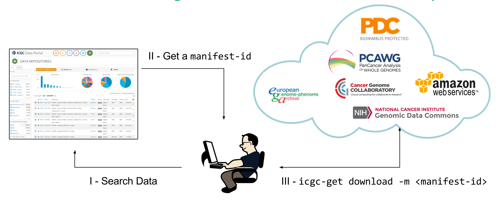
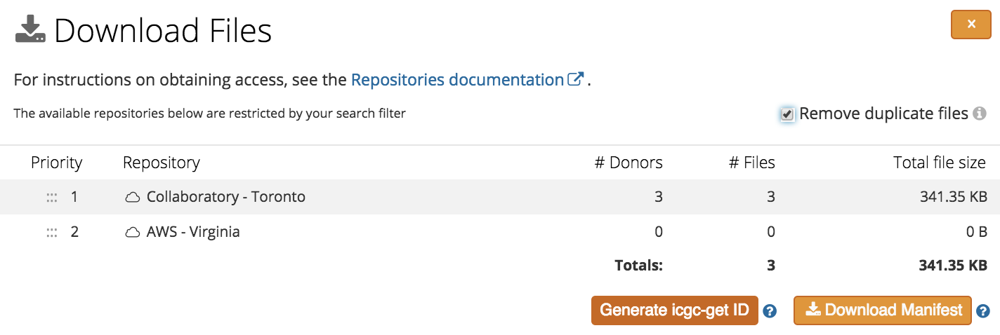

# icgc-get User Guide

## Overview

ICGC data resides in many data repositories and compute clouds around the world. These  [data repositories](/download/repositories/) each have their own environment (public cloud, private cloud, on-premise file systems, etc.), access controls (DACO, OAuth, asymmetric keys, IP filtering), data download clients and configuration mechanisms. Thus, there is much for a user to learn and perform before actually acquiring the data. This is compounded by the fact that the number of environments are increasing over time and their characteristics are frequently changing. A coordinated mechanism to bootstrap and streamline the data access process is highly desirable. This is the problem the `icgc-get` tool helps to solve.

<span style="color:red">***Please note:***</span>  Pre-requisites for accessing the different repositories, as described in the [Data Download Guide](/download/guide/#compute-prerequisites), still apply. Most notably, that access to AWS-Virginia requires `icgc-get` to be run from an EC2 instance launched in AWS-Virginia. 


As depicted in the figure below, downloading data with `icgc-get` is a three easy-step process: 

- Select data of interest using the [ICGC Data Repository browser](https://dcc.icgc.org/repositories) in the ICGC Data Portal. These files can belong to multiple repositories.
- Obtain a `icgc-get` manifest ID for this dataset by clicking on 'Generate icgc-get ID' button from the 'Download Files' dialog.
- Execute on the computer you want to download data the `icgc-get`’s `download `command with your manifest ID as parameter.

[](images/icgc-get-process.png "Click on the image to see it in full")

`icgc-get` will then download the requested data files from repositories you have access to in a configurable order of preferences. As simple as that!  More details and advanced features are described in sections below.


## Prerequisites

### Operating System

`icgc-get` is supported on MacOS and Linux environments. Windows is currently unsupported.

### Dependencies

Docker is required to use the pre-packaged download clients of the various respositories. To install Docker, please see the [installation guide](https://docs.docker.com/engine/installation/).

If not using Docker, it is expected that the user will have installed each of the [data download clients](/download/repositories/) required to access repositories of interest.

## Installation

The `icgc-get` client may be downloaded from the [Software Download page](/software/download/#icgc-get)

To install the latest version on Mac or Linux, issue the following in a terminal:

```shell
curl https://dcc.icgc.org/api/v1/ui/software/icgc-get/linux/latest -o icgc-get.latest.zip -L
unzip icgc-get.latest.zip
```

This will extract the `icgc-get` executable in the current directory.

## Configuration

After installing `icgc-get`, you will need to configure some of the essential usage parameters,
such as your access credentials, usage mode and output directory. The simplest way to do this is to invoke the `icgc-get configure` command and follow the instructions of the prompts. The information you provided will be kept in a configuration file saved to `~/.icgc-get/config.yaml`.


### Repository Precedence

Usually the same file exists in multiple repositories, it is recommended to specify a common list of repositories in your preferred order of precedence. When downloading a file, the tool will first try to find the file on the first specified repository, then the second, etc. 

Please use the following format to define your repositories in the configuration file.

```yaml
repos:
 - collaboratory
 - ega
 - pdc
```

Valid repositories are:

| Code                | Repository                     |
| --------            | -------------------------------          |
| `aws-virginia`      | [Amazon Web Services](/download/repositories/#aws)                      |
| `collaboratory`     | [Cancer Genome Collaboratory](/download/repositories/#collaboratory)                            |
| `ega`               | [European Genome Archive](/download/repositories/#ega)              |
| `gdc`               | [Genomic Data Commons](/download/repositories/#gdc)                     |
| `pdc`               | [Bionimbus Protected Data Cloud](/download/repositories/#pdc)           |


### Data Access Tokens / Credentials

Different repositories use different mechanisms to authenticate their users and authorize data access.

* ICGC and GDC use pre-generated tokens with specific scope of privileges. Details about generating ICGC token is described [here](/download/guide/#access-tokens). For GDC tokens, check [here](https://docs.gdc.cancer.gov/Data_Portal/Users_Guide/Authentication/#gdc-authentication-tokens).

* EGA uses username / password combination. You will have them set up when you create your EGA account. For support, contact <mailto:helpdesk@ega-archive.org>.

* PDC uses access keys (a pair of access key ID and secret access key). Follow the **Login from NIH** button on this [page](https://bionimbus-pdc.opensciencedatacloud.org/datasets) you will be directed to login via NIH iTrust. Upon successful login at NIH, you will be redirected back to PDC where you can now create access keys.


### Example Configuration File

By default configuration file exists at `~/.icgc-get/config.yaml`. Below is an example. You can manually edit the file as needed.

```yaml
# Location of the log file that icgc-get will log to.
logfile: /home/ubuntu/.icgc-get/icgc_get.log

# Location for the destination directory for downloaded files.
output: /my_icgc_files

# Use docker container for the storage clients, rather than providing your own client.
# If set to 'False', you will need to install needed download client and
# set the full path to it for each repository.
docker: True

# Repositories to use and their precedence.
repos:
- collaboratory
- aws-virginia
- pdc

# ICGC
icgc:
  token: <your_icgc_download_token>
  path: /path/to/icgc/score/client  # full path to score client

# EGA
ega:
 username: <username>
 password: <password>
 path: /path/to/ega/client  # full path to EGA download client


# GDC
gdc:
 token: <gdc_token>
 path: /path/to/gdc/client   # full path to GDC download client


# PDC
pdc:
  key: <pdc_key>
  secret: <pdc_secret>
  path: /path/to/pdc/client  # full path to aws cli client
```

## Usage

General usage of the `icgc-get` tool:
```
icgc-get [OPTIONS] COMMAND [ARGS]
```

Available commands include: `configure`, `check`, `report`, `download`, `version`.

All commands share the `--config`, `--logfile` `--verbose/-v` and the `--docker` options.

| Universal Option  | Description                                          |
| ----------------- | ---------                                            |
| `--config`        | Path to configuration file                           |
| `--logfile`       | Path to log file                                     |
| `--verbose` `-v`  | Flag that increases tool verbosity                   |
| `-d`, `--docker`  | Boolean option whether to use in docker or not|

### Configure Command

This command will start a series of prompts for you to enter application paths, access credentials, output directories and logfile locations.
_Any of these prompts can be bypassed by immediately pressing the enter key if the parameter is not relevant for your planned use
of `icgc-get`._  By default, `configure` will write to the default config file, but the destination can be overwritten with
the `-c` tag.

| Option           | Description                                   |
|------------      |------------------------------------           |
| `-c`, `--config` | Destination for new or exisiting config file  |

### Check Command

This command will test the provided credentials for each repository specified.

Due to the security protocols of each client, there are two ways in which this access check can occur.
_For PDC and GDC `icgc-get` is only capable of determining if you have access to the specific
files targeted for download, not the state of your permissions for the repository as a whole._
When performing an access check for these repositories, you must provide a manifest id or
list of files using the same formatting as the `download` command. For more detailed information about
your permissions on these repositories contact their respective support departments.

For the AWS, Collaboratory, and EGA repositories, the access check will determine if you have access
to the entire repository or not. These checks will occur even if file prioritization leads to no files
being downloaded from any of these repositories.

| Option            | Description                                                        |
|-------------------|--------------------------------------------------------------------|
| IDS               | Specify FI ids to check access to.  Only required for PDC and GDC |
| `-r`, `--repos`   | Repeatable option used to specify repositories to download from    |
| `-o`, `--override`| Flag used to override warning messages                             |
| `--no-ssl-verify` | Flag used to disable ssl verification.  Not recommended            |

To do a status check on the same files used in the examples above:

```shell
./icgc-get check FI99996 FI99990 FI250134 -r collaboratory -r gdc
```

Sample output:

```
Valid access to the Collaboratory.
Valid access to the GDC files.
```

### Report Command

Another useful subcommand is `report`. This takes the same primary inputs as `download`,
but instead of downloading the specified files, it will provide a list of all files that are
about to be downloaded, including their size, data type, name and the repository they are hosted on.

| Option                | Description                                                     |
|-----------------------|-----------------------------------------------------------------|
| `-f`, `--table-format`| Controls output format.  Valid options are `json` and `tsv`     |
| `-t`, `--data-type`   | Controls output type.  Valid argument is `summary`              |
| `-r`, `--repos`       | Repeatable option used to specify repositories to download from |
| `-o`, `--override`    | Flag used to override warning messages                          |
| `--no-ssl-verify`     | Flag used to disable ssl verification.  Not recommended         |

By default the command outputs a table, but the output can be altered to json via `-f json` or tsv

via `-f tsv`. _Should you find file by file output too granular for a particularly large download,
the option `-t summary` can be used to switch to a summarized version of the table._  If an output directory
is specified, then the command will search that directory to determine of any of the files are already present,
and add a `downloaded` column that marks these files.

Example invocations of the `report` commands:

```shell
./icgc-get report FI99996 FI99990 FI250134 -r collaboratory -r gdc
```

Example invocations of the `report` commands:
```shell
./icgc-get report FI99996 FI99990 FI250134 -r collaboratory -r gdc -t summary
```

Sample output:

```
╒══════════╤════════╤════════╤═══════════════╤═══════════════╤═══════════════╕
│          │   Size │ Unit   │ File Format   │ Data Type     │ Repo          │
╞══════════╪════════╪════════╪═══════════════╪═══════════════╪═══════════════╡
│ FI99996  │   3.52 │ GB     │ BAM           │ Aligned Reads │ gdc           │
├──────────┼────────┼────────┼───────────────┼───────────────┼───────────────┤
│ FI99990  │  435.7 │ MB     │ BAM           │ Aligned Reads │ gdc           │
├──────────┼────────┼────────┼───────────────┼───────────────┼───────────────┤
│ FI250134 │ 197.44 │ KB     │ VCF           │ StGV          │ collaboratory │
╘══════════╧════════╧════════╧═══════════════╧═══════════════╧═══════════════╛
```

```
╒══════════════════════╤════════╤════════╤══════════════╤═══════════════╕
│                      │   Size │ Unit   │   File Count │   Donor_Count │
╞══════════════════════╪════════╪════════╪══════════════╪═══════════════╡
│ collaboratory        │ 197.44 │ KB     │            1 │             1 │
├──────────────────────┼────────┼────────┼──────────────┼───────────────┤
│ collaboratory: StGV  │ 197.44 │ KB     │            1 │             1 │
├──────────────────────┼────────┼────────┼──────────────┼───────────────┤
│ gdc                  │   3.94 │ GB     │            2 │             2 │
├──────────────────────┼────────┼────────┼──────────────┼───────────────┤
│ gdc: Aligned Reads   │   3.94 │ GB     │            2 │             2 │
├──────────────────────┼────────┼────────┼──────────────┼───────────────┤
│ Total                │   3.94 │ GB     │            3 │             3 │
├──────────────────────┼────────┼────────┼──────────────┼───────────────┤
│ Total: Aligned Reads │   3.94 │ GB     │            2 │             2 │
├──────────────────────┼────────┼────────┼──────────────┼───────────────┤
│ Total: StGV          │ 197.44 │ KB     │            1 │             1 │
╘══════════════════════╧════════╧════════╧══════════════╧═══════════════╛
```

### Download Command

The two syntax for performing a download using `icgc-get` are:

```shell
./icgc-get --config [CONFIG] --docker [true|false] download <file-ids> [REPO] [OPTIONS]
./icgc-get --config [CONFIG] --docker [true|false] download -m <manifest-id> [REPO] [OPTIONS]
```

| Option            | Description                                                     |
|-------------------|-----------------------------------------------------------------|
| `-m`, `--manifest`| Flag used to specify that a manifest id has been passed         |
| `-r`, `--repos`   | Repeatable option used to specify repositories to download from |
| `-o`, `--override`| Flag used to override warning messages                          |
| `--no-ssl-verify` | Flag used to disable ssl verification.  Not recommended         |

#### Download using FI IDs

To download files using their FI IDs, the required argument is one
or more File IDs of files you wish to download.

Using this command requires you to specify the repository or repositories that are being targeted for download, eg, `-r aws-virginia -r ega` if you have not set repository preferences in the configuration file. The order that the repositories are listed is important: files will be downloaded from the first specified repository if possible, and subsequent repositories
only if the file was not found on any previous repository.

The download command comes with an automatic prompt that warns the user if the projected download size approaches the
total available space in the download directory. It is possible to suppress this warning using the `-o` flag.

Sample invocation of the `download` command using FI ID:

```shell
./icgc-get download FI378424 -r collaboratory -r ega
```

#### Download using manifest ID

From the ICGC Portal [Data Repositories](https://dcc.icgc.org/repositories), user can search for files of her interest, then in the "Downlaod Files" dialog, click on "Generate icgc-get ID" to generate a manifest UUID that can be used by `icgc-get download -m` option.


[](images/icgc-get-manifest-id.png "Click on the image to see it in full")

With this option, user chooses the download repository preferences at the ICGC data portal, then when running `icgc-get` with the generated manifest ID there is no need to choose repository.

Sample invocation of the `download` command using manifest ID:

```shell
./icgc-get download -m c904ee8d-f0ea-4b94-aa85-e65fc1eb4940
```


### Version Command

This is an informative command that displays the version of all clients used by `icgc-get`. This command will check the version of clients that have their tool paths are specified in the config file provided.

```shell
./icgc-get version
```

Sample output:

```
ICGC-Get Version: 0.2.8
Clients:
 AWS CLI Version:             1.10.34
 EGA Client Version:          2.2.2
 GDC Client Version:          0.7
 ICGC Storage Client Version: 1.0.13
```

