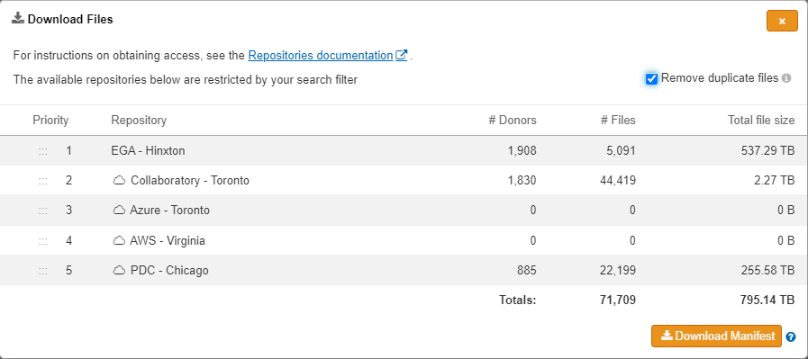
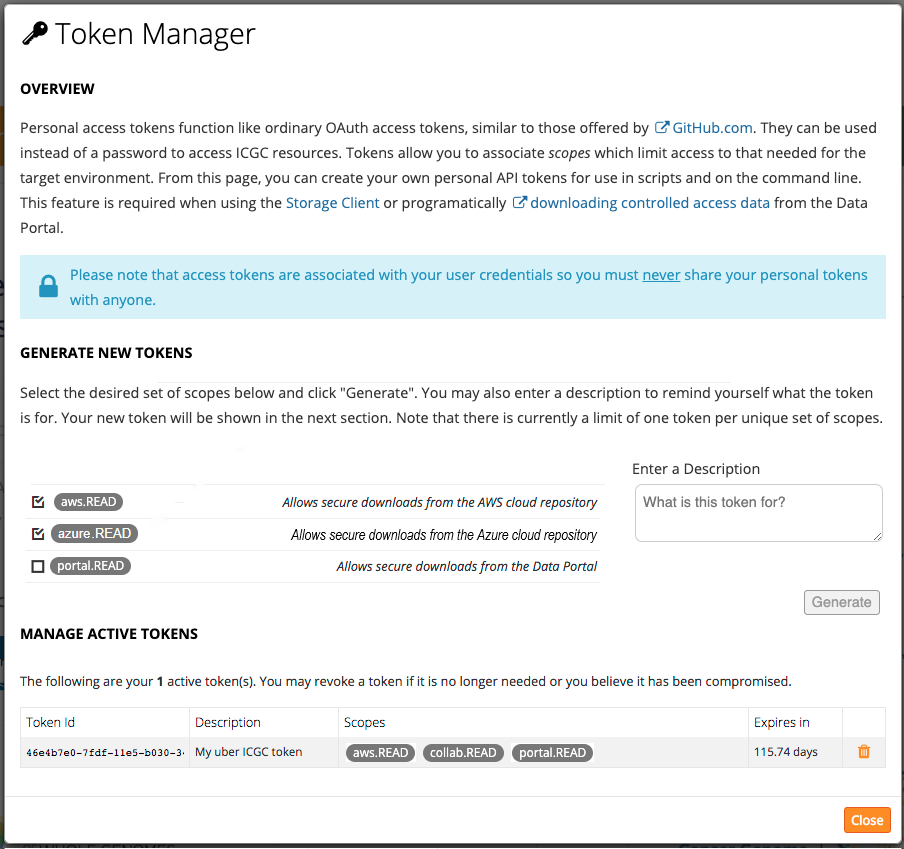
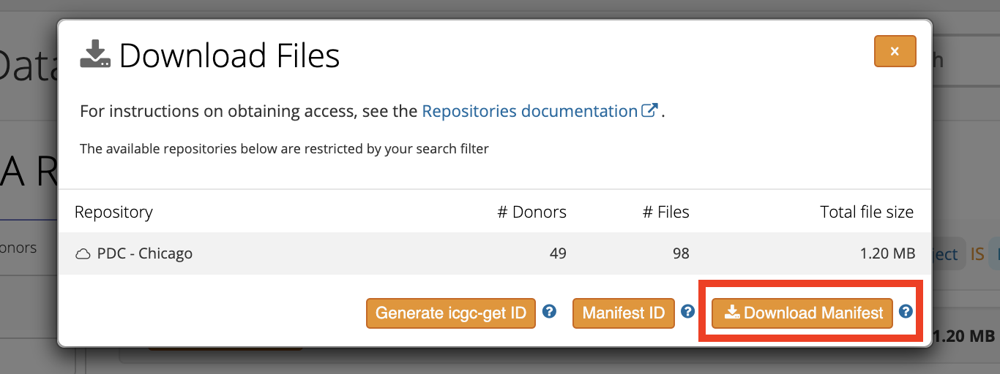
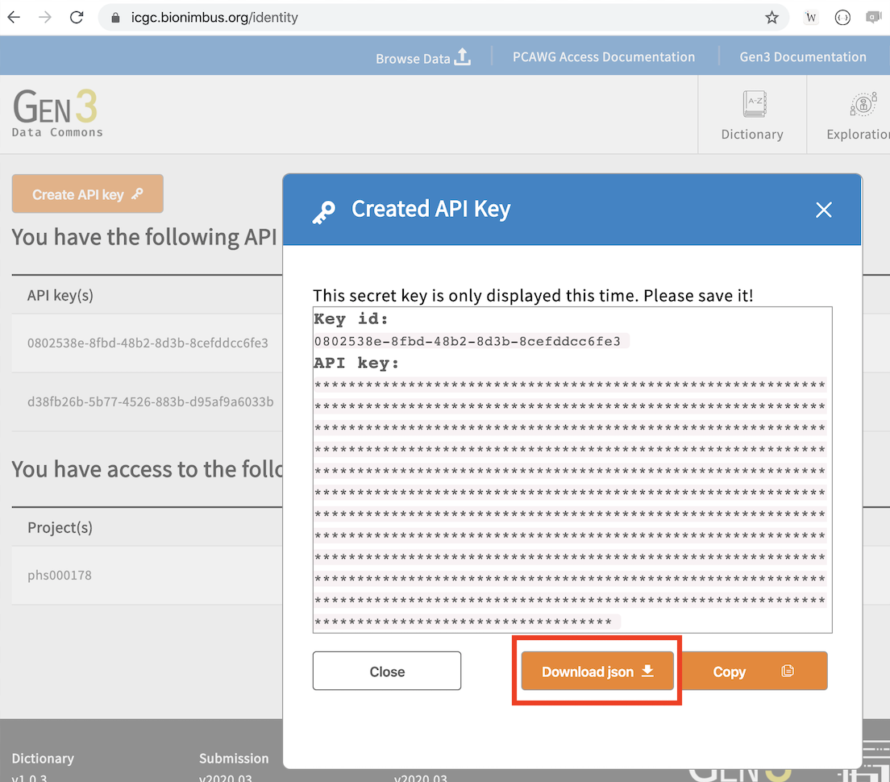

# Download PCAWG Data

### Data Repositories

Data produced by the PCAWG study has been deposited into multiple long-term storage
systems. This table gives you an overview where data for different types can be downloaded.

| Repository                                                                                                        | Storage type        | Data types                                                                    | Projects                        |
| ----------------------------------------------------------------------------------------------------------------- | ------------------- | ----------------------------------------------------------------------------- | ------------------------------- |
| ICGC Data Portal (<a href="https://dcc.icgc.org"><i class="fa-no-icon"></i>Portal</a>)                            | Web Accessible File | Downstream analysis results, cell line benchmarking, QC, reference genome etc | All Non-US projects             |
| Cancer Genome Collaboratory (<a href="https://cancercollaboratory.org"><i class="fa-no-icon"></i>Collab</a>)      | Data Object         | Aligned WGS, RNA-Seq, variant calls                                           | All Non-US projects             |
| Amazon Web Service (<a href="https://aws.amazon.com"><i class="fa-no-icon"></i>AWS</a>)                           | Data Object         | Aligned WGS, RNA-Seq, variant calls                                           | Subset of Non-US projects       |
| European Genome-phenome Archive (<a href="https://ega-archive.org"><i class="fa-no-icon"></i>EGA</a>)             | Data Archive        | Aligned WGS, RNA-Seq                                                          | All Non-US projects             |
| Protected Data Cloud (<a href="https://bionimbus-pdc.opensciencedatacloud.org"><i class="fa-no-icon"></i>PDC</a>) | Data Object         | Aligned WGS, RNA-Seq, variant calls, downstream analysis results              | All US projects (TCGA projects) |
| Microsoft Azure (<a href="https://azure.microsoft.com/en-ca/"><i class="fa-no-icon"></i>Azure</a>) | Data Object | Aligned WGS, RNA-Seq, variant calls, downstream analysis results              | Subset of Non-US projects |

_NOTE:_ Subset of Non-US projects with policy permits data to be hosted at AWS can be found
from <a href="aws_projects.txt"><i class="fa-no-icon"></i>here</a>.

### Apply for Data Access

Most of the PCAWG data is controlled access that is subject to data usage agreement. Please follow instructions at [_ICGC DACO_](https://daco.icgc-argo.org/) to apply for access to controlled data of all non-US projects. For US TCGA portion of the PCAWG data, apply for access through [_dbGaP_](https://dbgap.ncbi.nlm.nih.gov).

### Browse / Search for PCAWG Data

Although PCAWG results are physically stored in multiple repositories, the ICGC Data Portal
provides a one-stop-shop entry point to browse / search for all PCAWG data.

#### Browse PCAWG Data

In the portal's Data Release section, there is a dedicated [_PCAWG_](https://dcc.icgc.org/releases/PCAWG)
directory where you can browse study-wide datasets (such as cell line benchmarking,
QC, reference sequences) and downstream analysis results (usually associated with
PCAWG publications).

The data portal presents a simple interface allowing users to navigate through the
entire [_PCAWG_](https://dcc.icgc.org/releases/PCAWG) data directory. Besides the data files,
most of the sub-directories contain a README file that
gives a summary of data content, and provides additional information about how to
access related data in external systems. For example, the README in
[germline_variations](https://dcc.icgc.org/releases/PCAWG/germline_variations) describes
how the germline callset was generated, and where ICGC portion and TCGA portion
of the results can be downloaded.

#### Search for PCAWG data

A faceted search interface at the ICGC portal offers an easy way to interactively search
for PCAWG data of your interest.

This particular [query](https://dcc.icgc.org/repositories?filters=%7B%22file%22:%7B%22study%22:%7B%22is%22:%5B%22PCAWG%22%5D%7D%7D%7D&files=%7B%22from%22:1%7D) set a filter on _Study = 'PCAWG'_, it returns
all PCAWG data objects. Results are listed in a table with File ID, Donor ID, Repository etc
important information. You can add more filters as needed, for examples, adding _RNA-Seq_ in
_Experimental Strategy_, will further narrow down the resulting data objects to _PCAWG RNA-Seq_.
[Here](https://dcc.icgc.org/repositories?filters=%7B%22file%22:%7B%22study%22:%7B%22is%22:%5B%22PCAWG%22%5D%7D,%22experimentalStrategy%22:%7B%22is%22:%5B%22RNA-Seq%22%5D%7D%7D%7D&files=%7B%22from%22:1,%22size%22:25%7D) is the new, resulting query. If you prefer to download data from
certain repositories, you can select the desired repositories as needed.

After identifying files of interest, click on the _Download Files_ button
which will bring up a dialog window displaying a summary of file counts and total size broken
down by repository. As many files are distributed in multiple locations, you may want to prioritize
on certain repositories. You may enable _Remove duplicate files_ as well, it will remove files that exist in a
repository that was already presented. Finally, you can click on _Download Manifest_
which will download a tarball of manifest files, one for each chosen repository.



Manifest file format differs from one repository to the other, and thus each manifest
must be used with the corresponding client tool to actually download the data.
The following section will cover how to perform data download from different
repositories using manifest files.

### Download Data

#### Download from ICGC Data Portal

As mentioned earlier, data files hosted in ICGC Data Portal can be browsed in a web browser,
downloading specific file of interest is a matter of a mouse click.

Open access data hosted under the _PCAWG_ directory and its subdirectories can be downloaded
without logging in. However, you must login to the Data Portal before you are able to download or
even see the controlled access data files. Click on the _Login_ button on the top right corner,
and follow steps. Once successfully logged in, you should be able to see two green icons
(beside your account name) like shown below on the top row of the portal. This assumes that you have
already been approved by ICGC DACO for accessing controlled data.


Once logged in, you will be able to browse the [_PCAWG_](https://dcc.icgc.org/releases/PCAWG)
directory as usual with controlled access data files visible and downloadable.

#### Retrieve Access Tokens from ICGC Data Portal

When logged in you should be able to use the _Token Manager_ (as shown above) to create
**access token** for yourself to be used to download
data from _Collaboratory_,  _AWS_ and _Azure_ (see more details on how in the next section). Tokens expire
in a year, you can delete a token before expiry at anytime.



#### Download from Collaboratory or AWS or Azure

Score Client is used to download from _Collaboratory_ or _AWS_ or _Azure_
with a TSV manifest file containing necessary information about data objects to be downloaded.

The latest version of Score Client can be downloaded from [here](https://artifacts.oicr.on.ca/artifactory/dcc-release/bio/overture/score-client/[RELEASE]/score-client-[RELEASE]-dist.tar.gz). If you are on a Linux
system and already have Java 8 installed, you can have Score Client ready to use with the following commands:

```
wget -O score-client.tar.gz https://artifacts.oicr.on.ca/artifactory/dcc-release/bio/overture/score-client/[RELEASE]/score-client-[RELEASE]-dist.tar.gz

tar xvzf score-client.tar.gz

echo export PATH=$(pwd)/score-client-x.x.x/bin:$PATH >> ~/.bashrc

source ~/.bashrc

# you will then be able to use it by running the following command anywhere is the system
score-client
```

Before you can actually download controlled access data, you will need to add the
ICGC access token in the following file:
`score-client-x.x.x/conf/application.properties`. In the file, you should see a line like shown below. Uncomment it, add your access token, and save the file.

```
# accessToken=your_access_token
```

Assuming that you downloaded a manifest file (`manifest.collaboratory.1525977569066.tsv`)
from ICGC data portal in the previous step, the manifest will contain files from Collaboratory.
The following command will download these files to the current directory:

```
score-client --profile collab download --manifest manifest.collaboratory.1525977569066.tsv --output-dir .
```

**NOTE:** Downloading data objects hosted in Collaboratory is no longer required to be performed in a Collaboratory compute instance. When downloading PCAWG data from AWS or Azure, the download
client must run in the same environment as the object storage system. That means to download from AWS (N. Virginia), the Score Client **must** run on an AWS VM in the _N. Virginia_ availability zone. To download data from Azure, you will need your own Azure account to provision a running Azure instance and the score-client must run on an Azure VM.

#### Download from EGA

After getting your ICGC DACO approval, you will recieve an email from EGA about setting up your password. If you already had an EGA account from before, you will use the same username/password to access ICGC controlled data at EGA.

For EGA data download, the manifest file you download from ICGC Data Portal is actually a shell
script with a few variables need to be
replaced by actual values, such as, username, password, output_dir etc. The script utilizes
EGA Java download client which is documented with more details
[here](https://ega-archive.org/download/using-ega-download-client). You may modify the manifest script
to suit your own need. For example, if download involves too many files it could be inefficient
to request all of them at once. You may change the script so that it requests one file at a time,
finish downloading and decrypting one file, then move on to the next file.

#### Download from PDC

##### Download manifest file from ICGC Portal

As described in the [Search for PCAWG data section](#search-for-pcawg-data), once you satisfied with the search result of TCGA data files, click on the "Download Manifest" button as illustrated below to retrieve the manifest tarball (named as `manifest.*.tar.gz`). Unpack the tarbal, you should get a file named as `manifest.pdc.*.sh`, eg, `manifest.pdc.1586448715169.sh`.




##### Convert ICGC manifest file to PDC's Gen3 manifest file

We need to convert the mainfest file to PDC's Gen3 manifest file before downloading the actual data files. A Python script (`dcc_to_gen3.py`) is needed to perform the conversion, the script can be downloaded with the following command:

```
wget https://raw.githubusercontent.com/uc-cdis/pdc_tools/1.0/dcc_manifest_conversion/dcc_to_gen3.py
```

You need to have Python 3 and required libraries (such as numpy and pandas) installed. Once installed, you can run the script to get Gen3 manifest file. Remember to replace the ICGC manifest with your own file name.
```
python dcc_to_gen3.py --manifest manifest.pdc.1586448715169.sh
```

This will produce a Gen3 manifest file named as `gen3_manifest_manifest.pdc.1586448715169.sh.json`, which contains information needed to download the acctual data from PDC using `gen3-client` tool.

##### Install Gen3-client

Run the following commands to install `gen3-client` if you are using macOS:
```
mkdir -p ~/.gen3
echo "" >> ~/.bashrc
echo "export PATH=\$PATH:~/.gen3" >> ~/.bashrc
curl https://api.github.com/repos/uc-cdis/cdis-data-client/releases/latest | grep browser_download_url.*osx |  cut -d '"' -f 4 | wget -qi -
unzip dataclient_osx.zip
mv gen3-client ~/.gen3
rm dataclient_osx.zip
source ~/.bashrc
```

With that you should be able to run `gen3-client` command from your console and see the usage message.

For installing `gen3-client` on other OS, please follow instructions [here](https://gen3.org/resources/user/gen3-client).

##### Get gen3-client API key and configure your profile

Now you need to create `gen3-client` API key from [https://icgc.bionimbus.org](https://icgc.bionimbus.org) after authentication
via NIH eRA commons. To do that goto [login page](https://icgc.bionimbus.org/login), and click on "Login with NIH" button. After authenticated successfully, please goto [https://icgc.bionimbus.org/identity](https://icgc.bionimbus.org/identity) to create
the API key. On the popup dialog click on "Download json" to retrive API key, as shown below:



The API key will be saved as `credentials.json`. You can then use it to configure a profile, let's name the profile `icgc`:

```
gen3-client configure  --profile=icgc --cred=credentials.json --apiendpoint=https://icgc.bionimbus.org/
```
Upon success, you should see a message: Profile 'icgc' has been configured successfully.


##### Download data using gen3-client download-multiple command

With `icgc` profile configured, you can download the PCAWG data using the gen3 manifest prepared earlier as follow:

```
gen3-client download-multiple --profile=icgc --manifest=gen3_manifest_manifest.pdc.1586448715169.sh.json --no-prompt
```


# Analyze PCAWG Data on Collaboratory

### Leverage compute and data colocation

As noted above, [a large portion of the PCAWG data](https://dcc.icgc.org/repositories?filters=%7B%22file%22:%7B%22study%22:%7B%22is%22:%5B%22PCAWG%22%5D%7D%7D%7D&files=%7B%22from%22:1%7D) is hosted at
the [Cancer Genome Collaboratory](https://cancercollaboratory.org) - an
OpenStack based academic cloud computing platform. This makes Collaboratory an ideal choice to perform your own analyses
on PCAWG data, following a commonly practised <i>move compute to data</i> approach. In essence, there is no need to download
large amount of data into your own computing facilities and manage them, instead you launch virtual machines (VMs) and run your
code on PCAWG data provisioned from within the Collaboratory environment which is much more efficient and cost effective.


### Request a Collabotory account

You can find out more about services provided by Collaboratory at
[https://cancercollaboratory.org/services](https://cancercollaboratory.org/services) and available cloud resources
at [https://cancercollaboratory.org/services-cloud-resources](https://cancercollaboratory.org/services-cloud-resources).

To request a Collaboratory account please visit:
[https://cancercollaboratory.org/services-request-account](https://cancercollaboratory.org/services-request-account).

