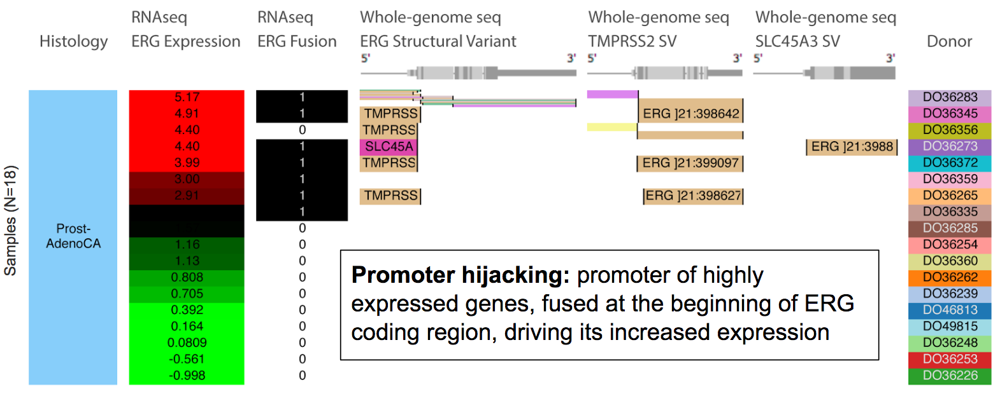

full_width: true

    

         
        The PCAWG study is an international collaboration to identify common patterns of mutation in more than 2,800 cancer whole genomes from the International Cancer Genome Consortium. The project produced large amount data with many types including simple somatic mutations (SNVs, MNVs and small INDELs), large-scale somatic structural variations, copy number alterations, germline variations, RNA expression profiles, gene fusions, and phenotypic annotations etc. PCAWG data have been imported, processed and made available in the following four major online resources for download and exploring.
    

 
 

    

          
        The ICGC Data Portal is the main data dissemination platform for ICGC. PCAWG data have been imported into or indexed by the data portal which makes data search / download / exploration simple and effective. Explore ICGC Data Portal at <a href="https://dcc.icgc.org">https://dcc.icgc.org</a>.
    

    

    

    

        
    

 

 

    

          
        UCSC Xena is an exploration tool for multi-omic resource data, enabling discovery of correlations among all open-access PCAWG primary results, and performance of survival analyses. Explore PCAWG data in UCSC Xena at <a href="https://pcawg.xenahubs.net">https://pcawg.xenahubs.net</a>.
    

    

    

    

        
    

 

 

    

          
        

Expression Atlas is an open science resource that gives users a powerful way to find information about gene and protein expression across species and biological conditions such as different tissues, cell types, developmental stages and diseases among others. Explore PCAWG data in EBI Expression Atlas at <a href="https://goo.gl/TsIYE5">https://goo.gl/TsIYE5</a>.
    

    

    

    

        
    

 

 

    

          
        PCAWGScout ... (description to be added). Explore PCAWG data in CNIO PCAWGScout at <a href="http://pcawgscout.bioinfo.cnio.es">http://pcawgscout.bioinfo.cnio.es</a>.
    

    

    

    

        
    

