# Projects

## Overview

The Projects page presents the list of all the cancer projects involved in the International Cancer Genome Consortium (ICGC).

A cancer project is characterized by a catalogue of genomic abnormalities (somatic mutations, abnormal expression of genes, epigenetic modifications) affecting donors.

## Browser

### Filtering

ICGC cancer projects can be filtered through the use of filtering facets, much like [Advanced Search](search.md) and [Data Repositories](repositories.md#filtering). Users can use the facets to check off desired attributes within a project file, and all the files with that attribute will be returned. Filters within the same facet, and across multiple facets can be overlapped.

| | |
| ---- | ---- |
| [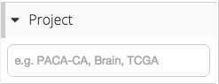](images/projects-project-id.png "Click on the image to see it in full")| Filter by Project ID |
| [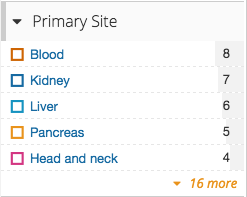](images/projects-primary-site.png "Click on the image to see it in full")| Filter by Primary Site affected |
| [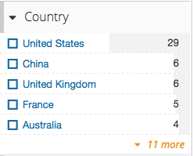](images/projects-country.png "Click on the image to see it in full")| Filter by Project Country origin |
| [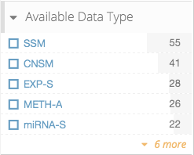](images/projects-available-data-type.png "Click on the image to see it in full")| Filter by Available Data Type |
| [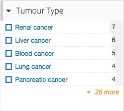](images/projects-tumour-type.png "Click on the image to see it in full")| Filter by Tumour Type |

### Tabs

When looking at the projects returned from filtering, a user can switch between looking at a [Summary](projects.md#summary), the [Details](projects.md#details), or the [History](projects.md#history) of the projects.

[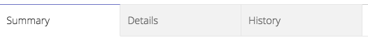](images/projects-tabs.png "Click on the image to see it in full")

#### Summary

[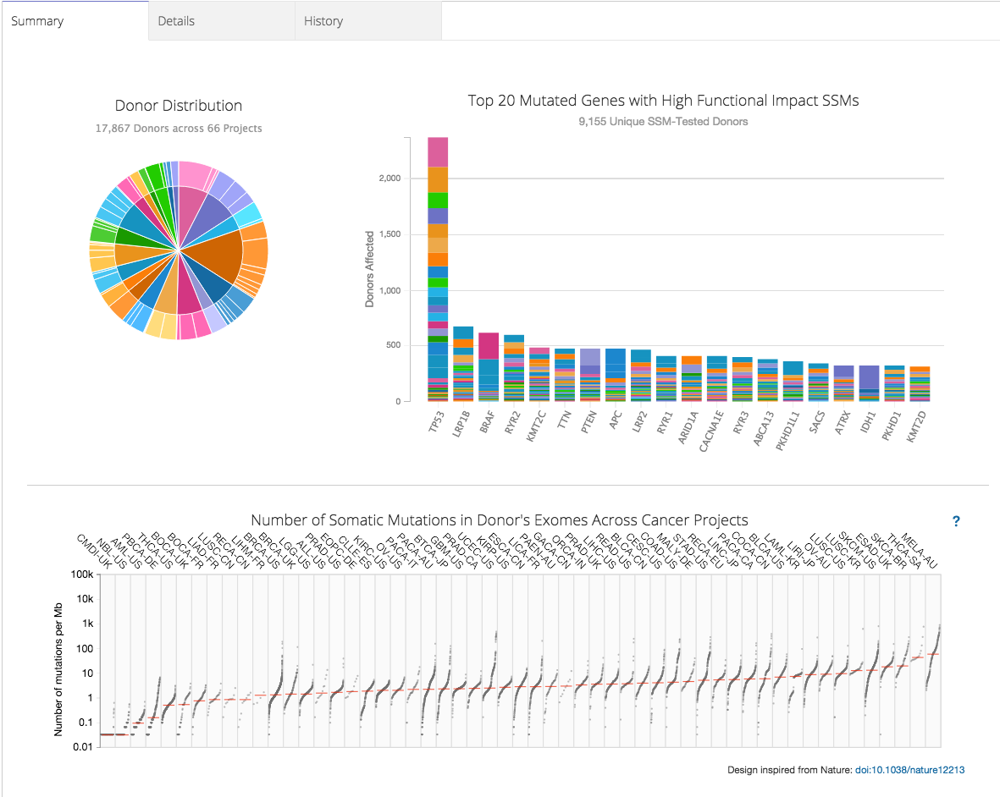](images/projects-summary.png "Click on the image to see it in full")

The summary tab allows a user to visualize general statistics on the current set of projects, which can be filtered through [Filtering](projects.md#filtering). 

[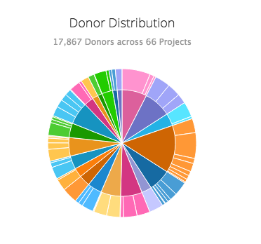](images/projects-donor-distribution.png "Click on the image to see it in full")

The Donor Distribution pie chart allows a user to see the amount of donors corresponding to each Primary Site. The inner circle displays how many donors contribute to a generalized site, such as Blood or Brain, whereas the outer circle splits up the different projects in each generalized site, ultimately displaying how many donors are in each project as well.

[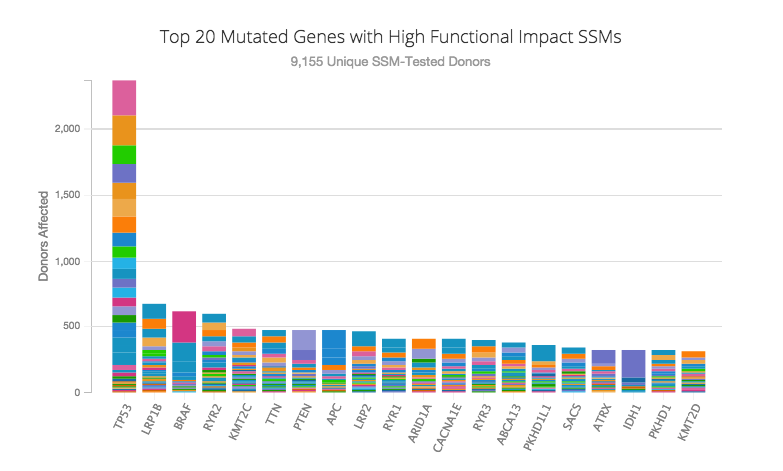](images/projects-top-20-chart.png "Click on the image to see it in full")

The Top 20 Mutated Genes with High Functional Impact SSMs chart visualizes the comparison between the top 20 mutated genes with high functional impact SSMs. The chart shows how many donors are affected by each of the top 20 genes.

[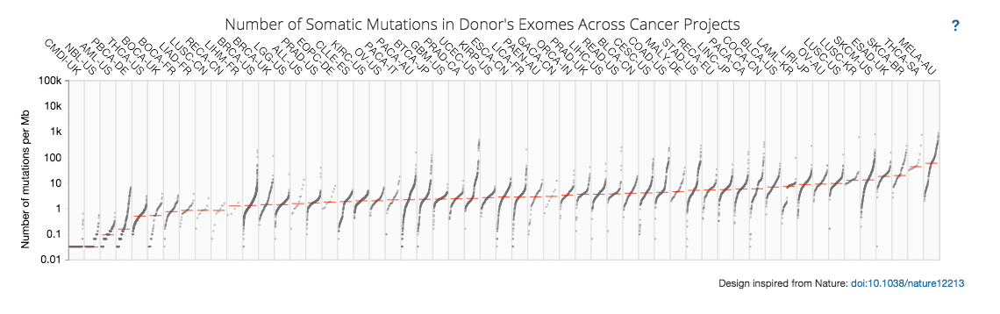](images/projects-number-of-somatic-mutations.png "Click on the image to see it in full")

The Number of Somatic Mutations in Donor's Exomes Across Cancer Projects chart visualizes the number of mutations per megabase.

#### Details

[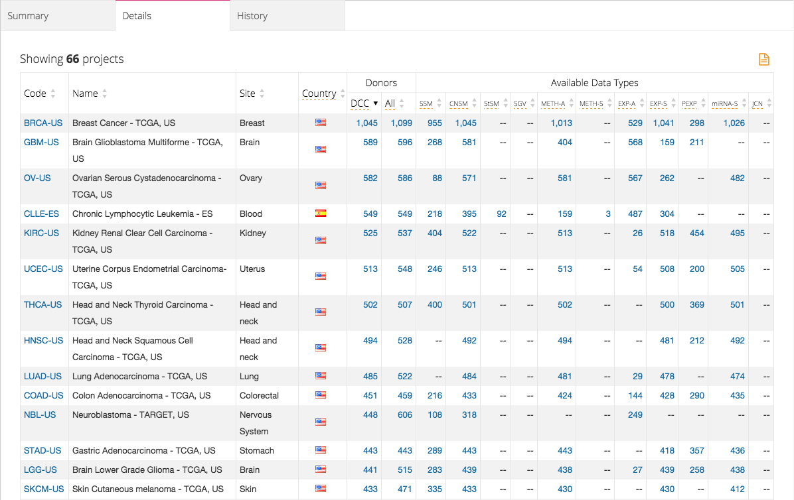](images/projects-details.png "Click on the image to see it in full")

The details tab allows a user to visualize detailed statistics on each project within the current set of projects, which can be filtered through [Filtering](projects.md#filtering). 

If a user is satisfied with the table generated, they can export and download the table as a TSV file.

#### History

[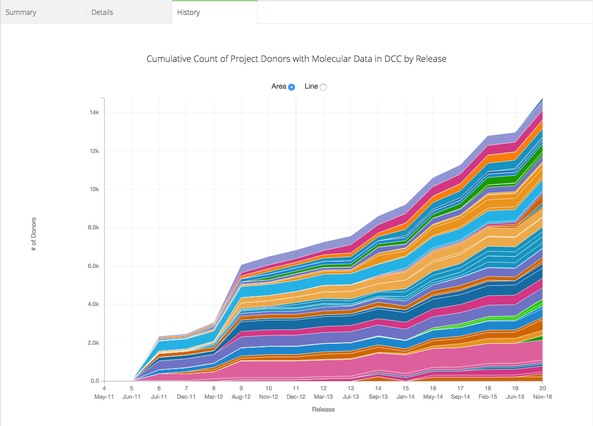](images/projects-history-area.png "Click on the image to see it in full")

The history tab allows a user to visualize the history of every project in the current set of projects within it's lifetime as a DCC cancer project. Selecting Area will show the cumulative count of Donors of all the projects. The set of projects can be filtered through [Filtering](projects.md#filtering).

[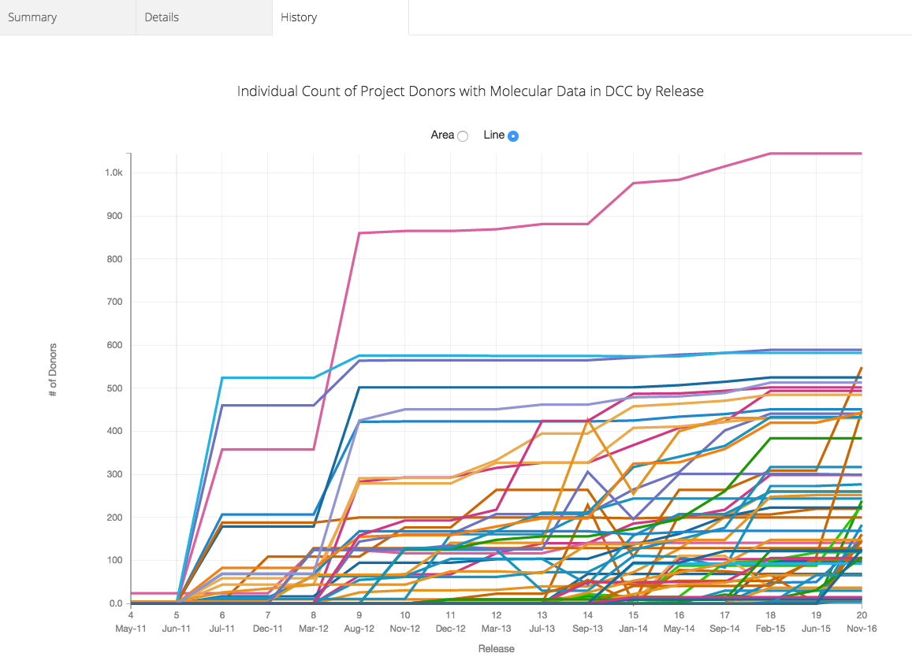](images/projects-history-line.png "Click on the image to see it in full")

Selecting Line will show the history of the donor count of each individual project.

[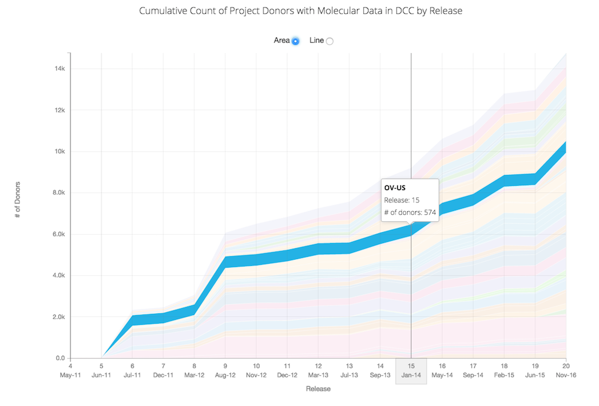](images/projects-history-area-hover.png "Click on the image to see it in full")

Hovering over a place in the graph allows the user to see the project, the release number and the number of donors at that time. The same functionality exists for the Line graph as well.
