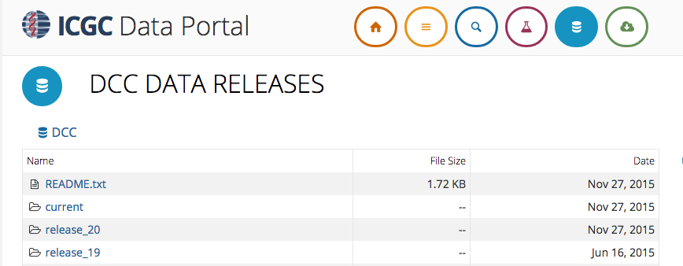
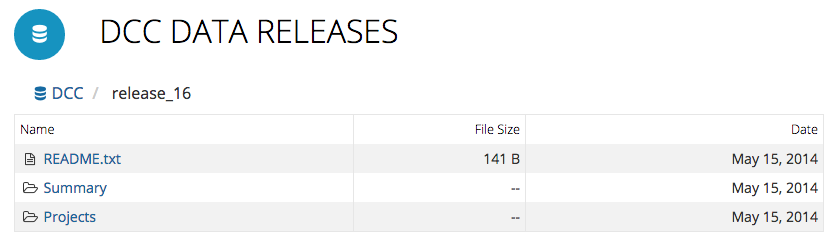
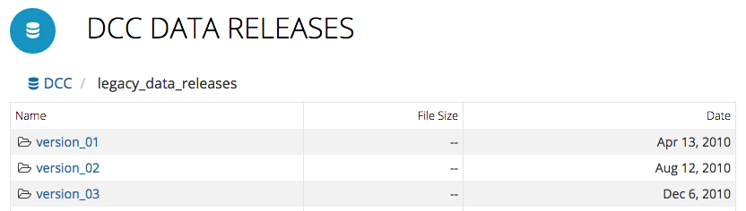

# Data Releases

## Overview

A DCC data release is a curated data set produced from clinical and experimental data submitted through the ICGC Data Submission site. Such data releases happen on average three times a year and are cumulative in nature. Each release is denoted by a number, such as _ICGC 20_ or _Release 20_.

The *DCC Data Releases* page is where you can browse and download archive data files for every DCC data release in the past. It can be located by clicking/tapping the blue disk icon on the top of the Data Portal site.

## Organization

Past data releases are listed in table form, from *Release 14* to the most current release.

Clicking a directory link navigates to the directory containing the release data content. The breadcrumb on the top of the table provides a context of where you are currently within directory hierarchy, and a way to quickly jump back to a particular level in the directory path.

### Release Directories

Each directory has a README.txt file, whose content is displayed below the table for your viewing convenience. Starting from *Release 16*, summary information is included in each release archive. For example, the *Release 16* directory shows two sub-directories, *Summary* and *Projects*. Under the *Summary* directory, summary files are available for download; large data files are located in the *Projects* directory. Releases prior to *Release 16* only provide large data files.

### Legacy Directories

Releases prior to *Release 14* can be located via the "legacy\_data\_releases" link below "release\_14". These are copies of the FTP archives which were previously hosted at [ftp://data.dcc.icgc.org]().

## Downloads

Clicking a file link initiates a download - most Web browsers prompt the user for where to save the file. Note that tools such as `wget` can also be used. Our API also supports the `-c` option to continue interrupted downloads.
