# Repositories

## Overview

The ICGC Data Repositories page is a means for users to browse through ICGC data. The ICGC data is periodically being aggregated and indexed, and is hosted on multiple archives and cloud repositories worldwide. The feature is best utilized through the use diverse filters provided, allowing the user to narrow down on projects throughout the repositories.

## Browser

The browser is made up of multiple parts, including [Filter Facets](repositories.md#filtering), [Results](repositories.md#results), [BAM statistics](repositories.md#bam-statistics), [Manifests](repositories.md#manifests), and [Donor Sets](repositories.md#donor-sets). 

[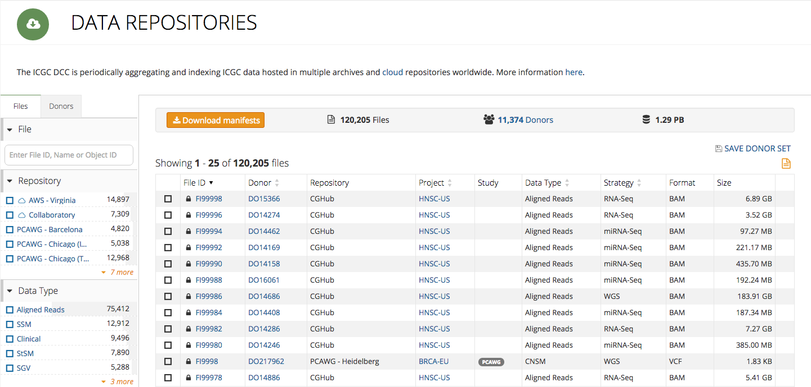](images/data-repository-browser.png "Click on the image to see it in full")

### Filtering

ICGC data is filtered through the use of facets, much like [Advanced Search](search.md) and [Projects](projects.md#filtering). Users can use the facets to check off desired attributes within a project file, and all the files with that attribute will be returned. Filters within the same facet, and across multiple facets can be overlapped. The two types of filters are [Donor Filters](repositories.md#donor-filters) and [File Filters](repositories.md#file-filters).

#### Donor Filters

Donor Filters correspond to facets that will filter by the donor's attributes. These filters are used if the user is looking for _donors_ of a certain characteristic.

| | |
| ---- | ---- |
| [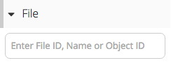](images/file-filter-file-id.png "Click on the image to see it in full")| Filter by File ID, File Name or Object ID |
| [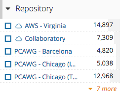](images/file-filter-repository.png "Click on the image to see it in full") | Filter by a list of repositories |
| [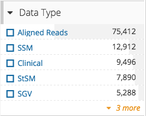](images/file-filter-data-type.png "Click on the image to see it in full") | Filter by the Data Type of the file |
|  | Filter by the Experimental Strategy of the file |
| [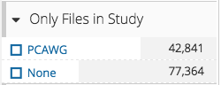](images/file-filter-in-study.png "Click on the image to see it in full") | Filter by files in certain studies |
| [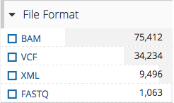](images/file-filter-file-format.png "Click on the image to see it in full") | Filter by the format of the file |
| [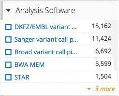](images/file-filter-analysis-software.png "Click on the image to see it in full") | Filter by the analysis software used |
| [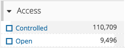](images/file-filter-access.png "Click on the image to see it in full") | Filter by whether or not the file is controlled |

#### File Filters

File Filters correspond to facets that will filter by the file's attributes. These filters are used if the user is looking for _files_ of a certain characteristic.

| | |
| ---- | ---- |
| [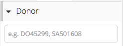](images/donor-filter-donor-id.png "Click on the image to see it in full") | Filter by a Donor ID |
| [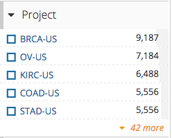](images/donor-filter-project.png "Click on the image to see it in full") | Filter by a certain project |
| [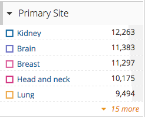](images/donor-filter-primary-site.png "Click on the image to see it in full") | Filter by the primary affected site of the donor |
| [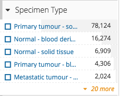](images/donor-filter-specimen-type.png "Click on the image to see it in full") | Filter by the specimen type |
| [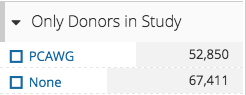](images/donor-filter-in-study.png "Click on the image to see it in full") | Filter by donors in certain studies |

### Results

Each result that returns from the filters can be selected for more details. Selecting a file will bring you to a file entity page, which provides information on the file. 

#### Summary

The summary section provides general information on the file.

[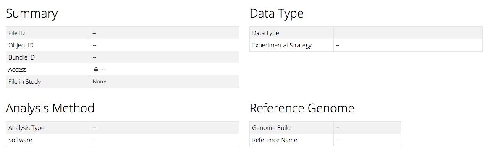](images/file-entity-summary.png "Click on the image to see it in full")

#### File Copies

The File Copies section provides information on the file entity, a means to download [Manifest](repositories.md#manifests) and see/download Metadata for the file.

[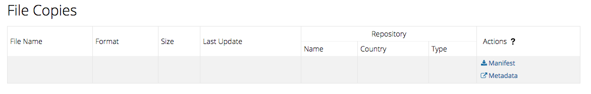](images/file-entity-file-copies.png "Click on the image to see it in full")

#### Donor

The Donor section provides information on the Donor that corresponds to the file selected.

[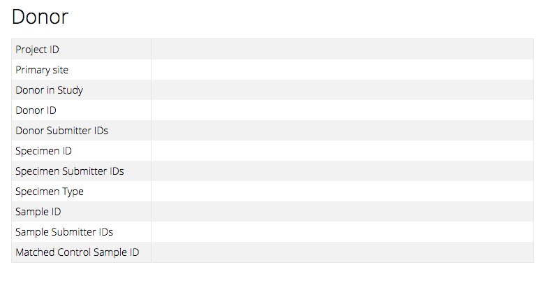](images/file-entity-donor.png "Click on the image to see it in full")

#### BAM Statistics

The BAM Stats section provides general information on the BAM file selected. This section is _only_ visible if the file selected is a BAM file _and_ the repository the file belongs in is AWS or Collaboratory

[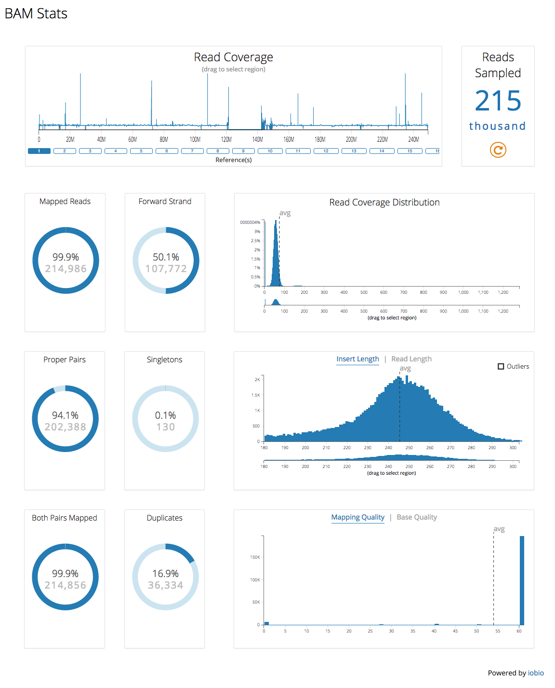](images/file-entity-iobio.png "Click on the image to see it in full")

### Manifests

A Manifest is a text file that is the main way to notify download clients what files should be downloaded. Each file entity has a Manifest per repository, and can be downloaded on the [File Copies](repositories.md#file-copies) section.

If the situation comes up where more than one file is needed, the **Download manifests** button can be used to download all the selected files, or if none are selected, all the files. The result would be a single Manifest file for each repository, containing all the files that belonged to that repository and were selected.

[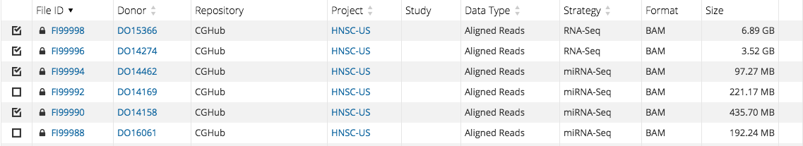](images/data-repository-selected-files.png "Click on the image to see it in full")
Selected 4(four) out of 7(seven) files in the same repository.

[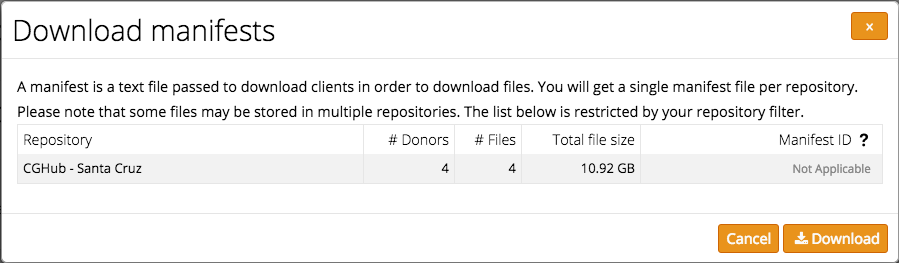](images/data-repository-download-manifest-modal.png "Click on the image to see it in full")
Only one Manifest file because the 4(four) files were in the same repository.

**Note**
For repositories such as Collaboratory and AWS, the Manifest ID is enough to download the requested files. For more detail on downloading these two files, click [here](/cloud/guide.md#overview)

### Donor Sets

A user has the ability to save a list of donors, using the "SAVE DONOR SET" feature. Saving a donor set allows for cross feature interaction. Once a donor set is saved, a user has the opportunity to upload it onto [Advanced Search](search.md). The result is a much higher level of detail comparing the similarities of the donors.

[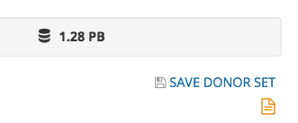](images/data-repositories-save-donor-set.png "Click on the image to see it in full")
[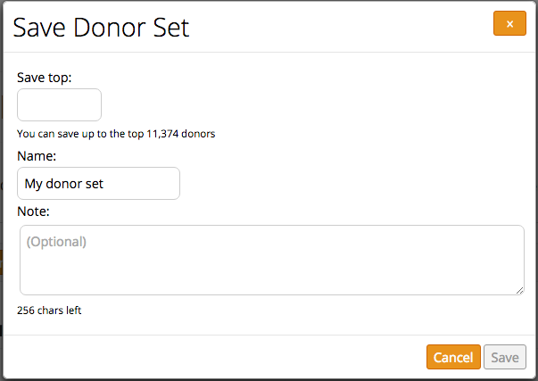](images/data-repositories-save-donor-set-modal.png "Click on the image to see it in full")

A user is able to choose how many of the donors to save starting from the top down, name the donor set, and set a note.